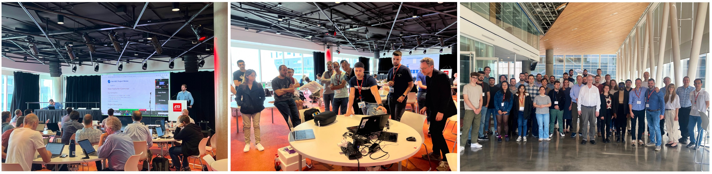
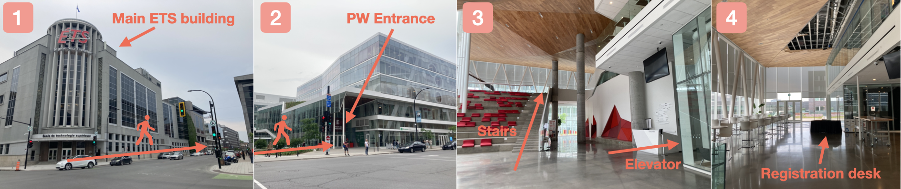

# Welcome to the web page for the 43rd Project Week!

Summary: 
[This event](https://projectweek.na-mic.org/PW43_2025_Montreal/README.html)  took place June 23rd - June 27th, 2025 in Montreal, Canada. 56 participants worked on 41 projects.  

## Location

École de Technologie Supérieure (ETS), Montreal, Canada - **E Building**

The images below show how to get to the Project Week 43 conference room. If you Google "ETS", it will take you to the main building of the university (1). You need to walk about 200 meters to get to the building called "Maison des étudiants" (2). Enter the building and either climb the stairs or take the elevator on the right to reach the second floor(3). From there, you should easily find the registration desk. 

Venue entrance on Google Maps: [https://goo.gl/maps/xNedgMBt4C6jwiCu5](https://goo.gl/maps/xNedgMBt4C6jwiCu5)

## Wifi
**Network name**: ETS-NAMIC-Invite
**User name**: ets-namic-invite@etsmtl.ca 
**password**: EY5VRT

## How to participate

* We hold weekly online preparation meetings before the workshop (Tuesdays 10am ET, from April 29 until the start of the workshop, [zoom link](https://etsmtl.zoom.us/j/82098172682?pwd=OHXPL5SlaLt817CzeBu8C1Pu21PvqW.1) 
* These meetings are an opportunity to introduce yourself, find a project you want to participate in during the workshop or propose one yourself and find collaborators. You will also find out more about how the workshop works. 
* If you have a project in mind already, you can create a draft of your project page in just a few minutes using the form [here](https://github.com/NA-MIC/ProjectWeek/issues/new?assignees=sjh26&labels=project%2Cevent%3APW43_2025_Montreal&projects=&template=project.yml&title=Project%3A+). The project description will help drive the discussion during preparation meetings.
* **Register as soon as possible** to help us plan the number of attendees (see instructions below)

## Registration
You can register for PW43 using the form [here](https://thepointofsale.com/tickets/namic-project-week-43). The registration fee is 400 CAN$ (approx. 290 US$ or 255 Euros) + 21.71 $CAN payment platform fees. It covers lunch for the 5 days of the workshop plus coffee and snacks throughout the day. 

## Remote participation
For members of the community that are unable to attend Project Week in person this time, it will be possible to watch the main sessions that will be broadcast on Zoom: 
1. Project introduction (Monday 10am ET)
2. What's new in Slicer breakout session (Tuesday 10am ET)
3. Project results presentation (Friday 10am ET)
Use the this [zoom link](https://etsmtl.zoom.us/j/82098172682?pwd=OHXPL5SlaLt817CzeBu8C1Pu21PvqW.1) to join.

A smaller conference room will be available throughout the week for other breakout sessions and meetings between on-site teams and remote participants. The room can be joined using the following [zoom link](https://etsmtl.zoom.us/j/98174045874?pwd=WTy1O4Q24f1jaanNelkZssymq6af2b.1).

## Discord
The **Discord** application is used to communicate between team members and organize activities before and during Project Week. Please join the Project Week [Discord server](https://discord.gg/AkxzKvqMBp) as soon as possible and explore its functionality before the workshop. For more information on the use of Discord before and during Project Week, please visit [this page](../common/Discord.md).

##  Agenda



## Breakout sessions

[Day 1 - Slicer Workflow Breakout](BreakoutSessions/Workflows/README.md)

[Day 2 - Slicer Update Breakout](BreakoutSessions/Slicer/README.md)

[Day 3 - Neuroanatomy Breakout](BreakoutSessions/Neuroanatomy/README.md)

[Day 4 - AR-VR and Rendering Breakout](BreakoutSessions/ARVRRendering/README.md)

## Projects

Begin creating your project page [here](https://github.com/NA-MIC/ProjectWeek/issues/new?assignees=sjh26&labels=project%2Cevent%3APW43_2025_Montreal&projects=&template=project.yml&title=Project%3A+)!

To learn how to create or update project pages, please refer to the [contributing project pages](ContributingProjectPages.md) section.



## Registrants

Do not add your name to this list below. It is maintained by the organizers based on your registration.

List of registered participants so far (names will be added here after processing registrations):

<!-- Participants list is updated programmatically, please don't remove the comments -->
<!-- Participants list start -->
1. Simon Drouin, ETS, Canada
1. Rafael Palomar, Oslo University Hospital, Norway
1. Ron Kikinis, Brigham and Women’s Hospital and Harvard Medical School, United States
1. Steve Pieper, Isomics, Inc., United States
1. Adam Wittek, UWA, Australia
1. Sajjad Arzemanzadeh, UWA, Australia
1. Liam O'Connor, Concordia University, Canada
1. Andrey Fedorov, Brigham and Women’s Hospital and Harvard Medical School, United States
1. Ivan Johnson-Eversoll, University of Iowa, United States
1. Hans Johnson, University of Iowa, United States
1. Chi Zhang, Texas A&M College of Dentistry, United States
1. Martin Bellehumeur, Bellehumeur Engineering, Germany
1. Mostafa Jamshidian, The University of Western Australia (UWA) , Australia
1. Ihssene Brahimi, ETS, Canada
1. Andrey Titov, ETS, Canada
1. Jarrett Rushmore, Boston University, United States
1. Vitor Azevedo Padovani, ETS, Canada
1. Benoît Verreman, ETS, Canada
1. Mauricio Juárez, ETS, Canada
1. Andras Lasso, Queen's University, Canada
1. Deepa Krishnaswamy, Brigham and Women’s Hospital and Harvard Medical School, United States
1. Étienne Léger, McGill University, Canada
1. Nicholas Kawwas, Concordia University, Canada
1. Amoon Jamzad, Queen's University, Canada
1. Lena Giebeler, RWTH Aachen University and Brigham and Women’s Hospital, United States
1. Maxime Bouthillier, Université de Montréal, Canada
1. Ahmed Rekik, ETS, Canada
1. Tina Nomena Herimino Nantenaina, ETS, Canada
1. Isabel Frolick, McGill University, Canada
1. Elise Donszelmann-Lund, McGill University, Canada
1. Hyung Tae Park, Truabutment, inc., United States
1. Junichi Tokuda, Brigham and Women's Hospital, United States
1. Enzo Tulissi, University of Michigan, United States
1. Alban Gaydamour, University of Michigan, United States
1. Lucia Cevidanes, University of Michigan, United States
1. Kyle Sunderland, Queen's University, Canada
1. Naomi Catwell, ETS, Canada
1. Jean-Christophe Fillion-Robin, Kitware, United States
1. Samantha Horvath, Kitware, United States
1. Houssem Gueziri, TÉLUQ University, Canada
1. Rui Li, New York University, United States
1. Tina Kapur, Brigham and Womens Hospital, United States
1. Sylvain Bouix, ETS, Canada
1. Hamze Rasaee, Concordia University, Canada
1. Tamas Ungi, ClaroNav Kolahi Inc, Canada
1. Sean Chen, ClaroNav Kolahi Inc, Canada
1. Juntae Park, AIRS Inc., South Korea
1. Benjamin Zwick, UWA, Australia
1. Raphaël Christin, McGill University, Canada
1. Taeyoung Ted  Park, Truabutment, inc., South Korea
1. Maha Kesibi, Queen's University, Canada
1. Lipeng Ning, Brigham and Women’s Hospital and Harvard Medical School, United States
1. Kaveh Moradkhani, ETS, Canada
1. Daniel Haehn, UMass Boston, United States
1. Paul Baksic, Centre Inria de l'Université de Lorraine, France
1. Mauro Ignacio Dominguez, Independent, Argentina
<!-- Participants list end -->

## Statistics

<!--  -->

## Organizers

* [@tkapur](https://github.com/tkapur) ([Tina Kapur, PhD](http://www.spl.harvard.edu/pages/People/tkapur)),
* [@drouin-simon](https://github.com/drouin-simon) ([Simon Drouin, PhD](https://drouin-simon.github.io/ETS-web//))
* [@rafaelpalomar](https://github.com/rafaelpalomar) ([Rafael Palomar, PhD](https://www.ntnu.edu/employees/rafaelp))
* [@piiq](https://github.com/piiq) ([Theodore Aptekarev](https://discourse.slicer.org/u/pll_llq))
* [@sjh26](https://github.com/sjh26) ([Sam Horvath, PhD](https://www.kitware.com/samantha-horvath/))

## History
Please read about our experience in running these events since 2005: [Increasing the Impact of Medical Image Computing Using
Community-Based Open-Access Hackathons: the NA-MIC and 3D Slicer Experience](http://perk.cs.queensu.ca/sites/perkd7.cs.queensu.ca/files/Kapur2016.pdf).
