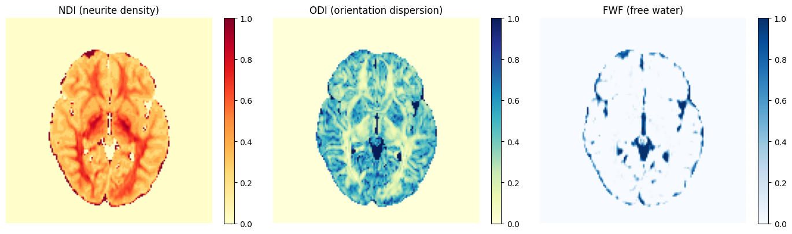
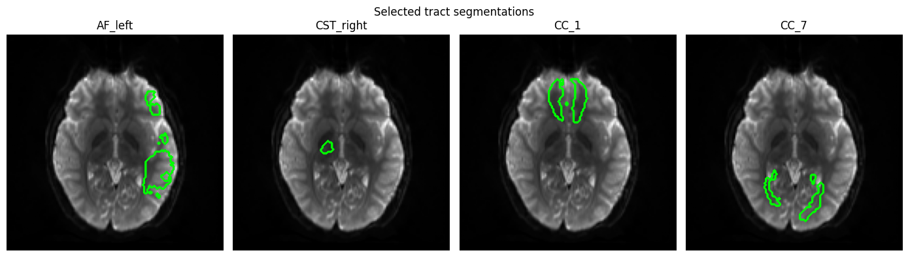
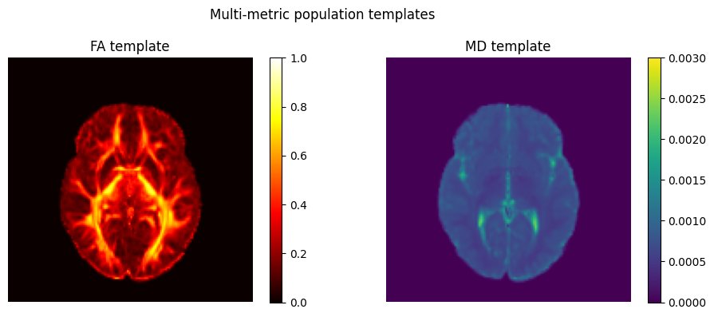

# Project Description

<!-- Add a short paragraph describing the project. -->

We've been working on a python library, currently (badly) named [abcdmicro](https://github.com/brain-microstructure-exploration-tools/abcd-microstructure-pipelines/), for diffusion MRI population analysis. Its goal is to make it easy to have the tools you need for processing population brain diffusion MRI in one convenient-to-set-up python package, with normally disparate processing steps getting linked together nicely. Slicer isn't where one would typically do large population analysis, but it is an excellent for visualizing examples while putting together a pipeline, and it's excellent for interacting with results. For this reason, I'd like to look into bridging abcdmicro with Slicer.

## Objective

<!-- Describe here WHAT you would like to achieve (what you will have as end result). -->

* Make it easy for someone who is building a dmri processing pipeline with abcdmicro to try out the steps of their pipeline in Slicer.

## Approach and Plan

<!-- Describe here HOW you would like to achieve the objectives stated above. -->

* Create vtk-mrml-based versions of some of the [`Resources`](https://github.com/brain-microstructure-exploration-tools/abcd-microstructure-pipelines/blob/e1ca05eed77a9fcc3e934c4de7f6f43fbcf8bc1f/src/abcdmicro/resource.py) in abcdmicro and conversion utilities that allow them to be created and used.

## Progress and Next Steps

<!-- Update this section as you make progress, describing of what you have ACTUALLY DONE.
     If there are specific steps that you could not complete then you can describe them here, too. -->

[Added two example notebooks](https://github.com/brain-microstructure-exploration-tools/abcd-microstructure-pipelines/pull/117) to abcdmicro. This helps introduce the functionality.

One notebook works up through NODDI estimation and tract segmentation for a particular subject:

The other demonstrates multimodal population template construction:

In a discussion with Arthur, here are some future directions we identified as valuable:

- Adding more pre-processing such as motion correction, gibbs ringing correction, etc.
- Incorporating strucural mri processing and handling co-registration
- Adding more microstructure models
- Support DICOM as an on-disk format, and consider having dicom-nifti conversion
- Adding (optional?) experimental parameters to DWI class (or a subclass?) to support things like time-dependent diffusion mri

## Final state of things

The outcome of this project was mostly discussions and ideas; here are a couple of last-minute updates to wrap things up:

- The abcdmicro notebooks now include built-in downloading of suitable example data. Now anybody can try them without having ABCD data! [Here is a snapshot you can try right now](https://github.com/brain-microstructure-exploration-tools/abcd-microstructure-pipelines/tree/6da13394a10e912d50cdc9ea26dccc5cae0f6b65/notebooks), but once they are merged you should refer to the main branch.
- After some back-and-forth on different ways of approaching the Slicer bridge, [here is a (AI generated) way of approaching a `SlicerVolumeResource`](https://gist.github.com/ebrahimebrahim/57d4f7f2999b29138a9ec4146febb7f3).

Side story: Trying to install abcdmicro into the Slicer python environment immediatley raised ia problem: abcdmicro depends on TractSeg which depends on fury which depends on a version of vtk that conflicts with Slicer's. To install it we had to install abcdmicro with `--no-deps`, then install the deps manually, except for TractSeg. In the case of TractSeg it has to be installed with `--no-deps`, and then its deps have to be installed manually, with the exception of fury. We don't need fury in Slicer. This whole story could have been averted if TractSeg made fury an optional dependency; abcdmicro doesn't really need fury after all. But we can't rely on package maintainers to do things the exact way we want. This story relates to my other PW44 project! It would be useful to support some way of just forcibly skipping a `Requirement`.

# Background and References

<!-- If you developed any software, include link to the source code repository.
     If possible, also add links to sample data, and to any relevant publications. -->

- [abcdmicro](https://github.com/brain-microstructure-exploration-tools/abcd-microstructure-pipelines/) is the library we have currently been working on for which I'd like to experiment with bridging with Slicer.

