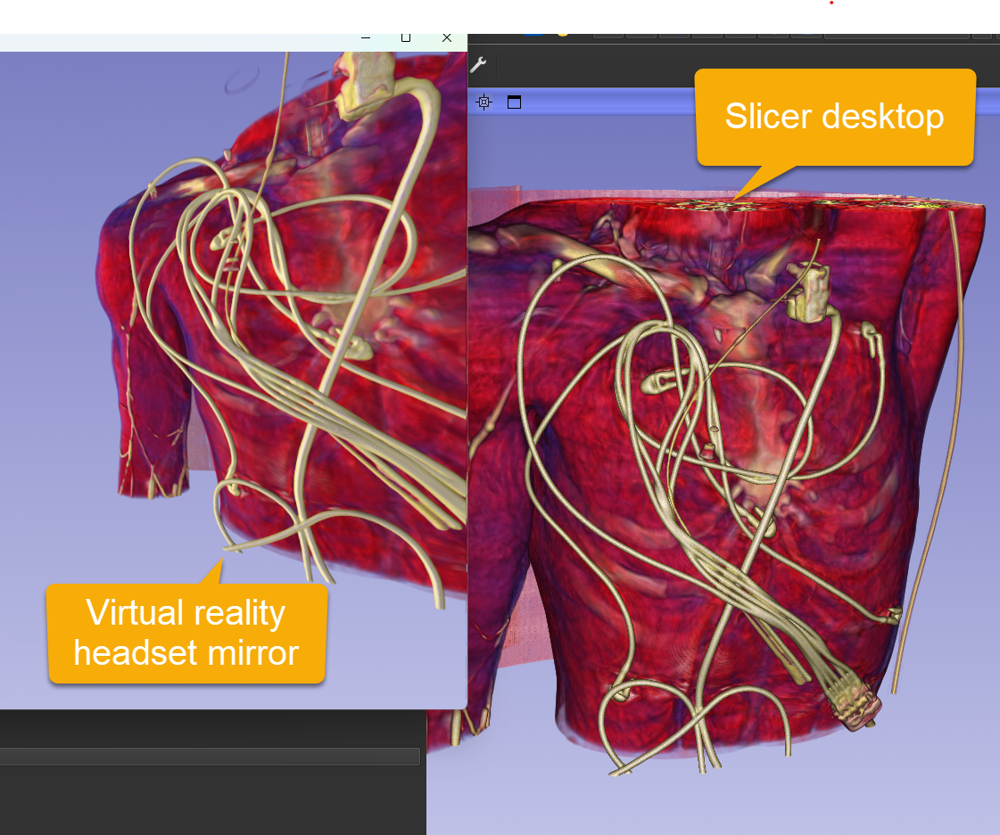

# Project Description

<!-- Add a short paragraph describing the project. -->

Currently SlicerVR is usable with OpenVR/OpenXR, however there are some pending issues:

- Nightly dashboard
    - Errors in the nighlty dashboard ([SlicerPreview Dashboard](https://slicer.cdash.org/viewBuildError.php?buildid=4075074))

- Performance
    - Adding markups to the scene causes an immediate drop in framerate and rendering artifacts
    - Visualization of interaction handles results in performance issues
    - Volume rendering with multi-component images/sequences causes a drop in framerate when the camera is close to the volume

- Visualization
    - Investigate "washed-out" appearance in VR view
 
- Interaction
    - Not all controller interactions are recognized
    - Investigate remappable controller bindings from python

- Etc.

## Objective

<!-- Describe here WHAT you would like to achieve (what you will have as end result). -->

Bring SlicerVR to stable, usable performance and complete basic interaction support.

## Approach and Plan

<!-- Describe here HOW you would like to achieve the objectives stated above. -->

1. Make SlicerVirtualReality available from the extension manager again
2. Profile and baseline performance (CPU, GPU, FPS in representative scenes)
3. Fix highest-impact performance issues (markups, widgets, volume rendering)
4. Add missing OpenXR controller input mapping
5. Iterate with testing in real scenes

## Progress and Next Steps

<!-- Update this section as you make progress, describing of what you have ACTUALLY DONE.
     If there are specific steps that you could not complete then you can describe them here, too. -->

1. SlicerVirtualReality is again available on the extension index ([SlicerPreview Dashboard](https://slicer.cdash.org/builds/4080509))
2. Greatly improved performance for rendering Markups in VR by bypassing depth check for visible points ([Slicer#8979](https://github.com/Slicer/Slicer/pull/8979)) ([SlicerVirtualReality#185](https://github.com/KitwareMedical/SlicerVirtualReality/pull/185))
3. Washed-out colors in virtual reality appear to be resolved.

# Illustrations

<!-- Add pictures and links to videos that demonstrate what has been accomplished. -->

### Color issue

#### Before

Left: Slicer view using OpenXR without shadows Right: VR view (with back lights / without two sided lighting)

#### Now

In latest Slicer Preview Release: colors are the same in desktop rendering and VR headset.

# Background and References

<!-- If you developed any software, include link to the source code repository.
     If possible, also add links to sample data, and to any relevant publications. -->

Previous project week page on color isues in virtual reality: [Previous Project Week](https://projectweek.na-mic.org/PW42_2025_GranCanaria/Projects/LightingProblemsWithLatestSlicervr/)
Extension repository: [SlicerVirtualReality](https://github.com/KitwareMedical/SlicerVirtualReality/)

