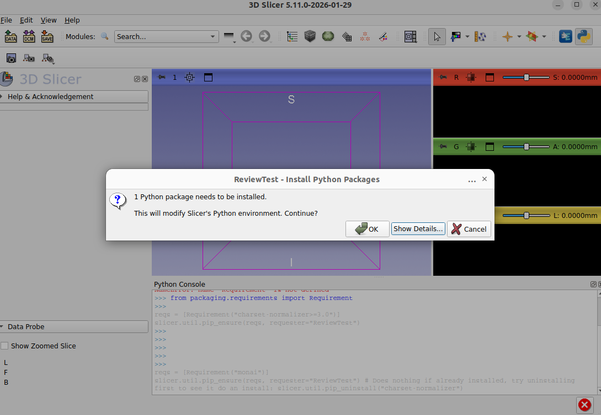
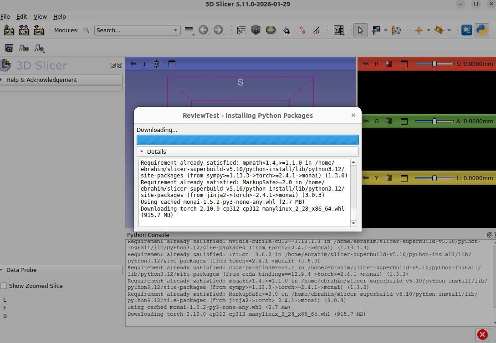

# Project Description

<!-- Add a short paragraph describing the project. -->


Many Slicer extension developers have to deal with the problem of external python dependencies: how to specify them, how and when to install them, and how to validate that the required things are installed. Everyone addresses the problem in a different way, often re-inventing the wheel and also often generating new great ideas. I'd like to collect all the best practices and turn them into a framework that is built into core slicer for extension developers to more easily grab and use. Something like "stick your dependencies in here and the use `slicer.util.check_python_dependences` and `slicer.util.install_python_dependencies`. If that turns out to be a bad idea for whatever reason, at least I can collect all the best practices and put them into the extension development documentation.


## Objective

<!-- Describe here WHAT you would like to achieve (what you will have as end result). -->


* Encode into Slicer some way to make it more convenient for extension developers to handle external python dependencies.


## Approach and Plan

<!-- Describe here HOW you would like to achieve the objectives stated above. -->


* Gather best practices on external python dependency handling in Slicer extensions, and then distill them into an optimized approach.
* Encode that approach in Slicer somehow, either as utility functions, updates to extension templates, or simply documentation.


## Progress and Next Steps

<!-- Update this section as you make progress, describing of what you have ACTUALLY DONE.
     If there are specific steps that you could not complete then you can describe them here, too. -->


### Table of existing practices

I've broken down the problem of external Python dependency into four components:

- **Specification:** How do we represent Python dependency requirements?
- **Checking:** How do we check whether the dependency requirements are already met by the environment?
- **Triggering:** What causes the requirement installation process to start?
- **Installing:** How do we carry out requirement installation?

The table below includes all 94 extensions that are currently in the [Slicer extension index](https://github.com/Slicer/ExtensionsIndex) and that have some external python dependencies to deal with, and my best quick guess as to how they approach three of the problems above.
Here is a legend to interpret the terms I've put in the table:

- **Checking:**
  - _simple_: Checkng is done by trying to import and and catching if it fails. It could also be done with importlib. No version checking.
  - _version_: Does some kind of version checking as well.
- **Triggering:**
  - _user_: Nothing triggers an automatic install. The user will have to install by following some steps.
  - _top level_: The install is triggered at some top level like the module enter function, such that it would happen the first time the module is even switched to for example. It could also be at the truly top-level-- in this case it would be triggered during module discovery, which is undesirable.
  - _processing_: When the user goes to run some kind of processing in the extension, that's when it actually checks if it has the dependencies it needs and kicks off install if not.
  - _button_: User has to press a button to install.
- **Installing:**
  - _user_: User has to do it by following some steps.
  - _simple_: Just `slicer.util.pip_install`.
  - _isolated_: There is a separate environment (such as a virtual env) into which the dependencies are installed (and so it is not going to be slicer's `pip_install` but some script or shell process that carries out installation).
  - _blocking-prevention_: Attempts to stop the installation from fully blocking the application. This could be by using threading of some sort or spawning a background process, or by otherwise trying to give slicer a chance to process events while the install is happening.
  - _display_: Has some more sophisticated display of what's going on while pip installing


---

<table>
     <thead>
          <tr>
               <th>Extension</th>
               <th>Checking</th>
               <th>Triggering</th>
               <th>Installing</th>
          </tr>
     </thead>
     <tbody>
          <tr>
               <td>ShapeVariationAnalyzer</td>
               <td style="background-color: #dddddd">simple</td>
               <td style="background-color: #eeeeee">user</td>
               <td style="background-color: #ccffcc; color: #006600">isolated</td>
          </tr>
          <tr>
               <td>SlicerVolBrain</td>
               <td style="background-color: #dddddd">simple</td>
               <td style="background-color: #eeeeee">user</td>
               <td style="background-color: #eeeeee">user</td>
          </tr>
          <tr>
               <td>PerkTutor</td>
               <td style="background-color: #dddddd">simple</td>
               <td style="background-color: #eeeeee">top level</td>
               <td style="background-color: #dddddd">simple</td>
          </tr>
          <tr>
               <td>Q3DCExtension</td>
               <td style="background-color: #dddddd">simple</td>
               <td style="background-color: #eeeeee">top level</td>
               <td style="background-color: #dddddd">simple</td>
          </tr>
          <tr>
               <td>QuantitativeReporting</td>
               <td style="background-color: #dddddd">simple</td>
               <td style="background-color: #eeeeee">top level</td>
               <td style="background-color: #dddddd">simple</td>
          </tr>
          <tr>
               <td>SegmentationReview</td>
               <td style="background-color: #dddddd">simple</td>
               <td style="background-color: #eeeeee">top level</td>
               <td style="background-color: #dddddd">simple</td>
          </tr>
          <tr>
               <td>Slicer-ABLTemporalBoneSegmentation</td>
               <td style="background-color: #dddddd">simple</td>
               <td style="background-color: #eeeeee">top level</td>
               <td style="background-color: #dddddd">simple</td>
          </tr>
          <tr>
               <td>Slicer-ASLtoolkit</td>
               <td style="background-color: #dddddd">simple</td>
               <td style="background-color: #eeeeee">top level</td>
               <td style="background-color: #dddddd">simple</td>
          </tr>
          <tr>
               <td>Slicer-MusculoskeletalAnalysis</td>
               <td style="background-color: #dddddd">simple</td>
               <td style="background-color: #dddddd">processing</td>
               <td style="background-color: #dddddd">simple</td>
          </tr>
          <tr>
               <td>Slicer-PET-MUST-segmenter</td>
               <td style="background-color: #dddddd">simple</td>
               <td style="background-color: #eeeeee">top level</td>
               <td style="background-color: #dddddd">simple</td>
          </tr>
          <tr>
               <td>Slicer-TITAN</td>
               <td style="background-color: #dddddd">simple</td>
               <td style="background-color: #dddddd">processing</td>
               <td style="background-color: #dddddd">simple</td>
          </tr>
          <tr>
               <td>SlicerANTsPy</td>
               <td style="background-color: #dddddd">simple</td>
               <td style="background-color: #eeeeee">top level</td>
               <td style="background-color: #dddddd">simple</td>
          </tr>
          <tr>
               <td>SlicerAnatomyCarve</td>
               <td style="background-color: #dddddd">simple</td>
               <td style="background-color: #eeeeee">top level</td>
               <td style="background-color: #dddddd">simple</td>
          </tr>
          <tr>
               <td>SlicerArduinoController</td>
               <td style="background-color: #dddddd">simple</td>
               <td style="background-color: #eeeeee">top level</td>
               <td style="background-color: #dddddd">simple</td>
          </tr>
          <tr>
               <td>SlicerAuto3dgm</td>
               <td style="background-color: #dddddd">simple</td>
               <td style="background-color: #eeeeee">top level</td>
               <td style="background-color: #dddddd">simple</td>
          </tr>
          <tr>
               <td>SlicerAutomatedDentalTools</td>
               <td style="background-color: #ccffcc; color: #006600">version</td>
               <td style="background-color: #dddddd">processing</td>
               <td style="background-color: #dddddd">simple</td>
          </tr>
          <tr>
               <td>SlicerAutoscoperM</td>
               <td style="background-color: #dddddd">simple</td>
               <td style="background-color: #dddddd">processing</td>
               <td style="background-color: #dddddd">simple</td>
          </tr>
          <tr>
               <td>SlicerBigImage</td>
               <td style="background-color: #dddddd">simple</td>
               <td style="background-color: #dddddd">processing</td>
               <td style="background-color: #dddddd">simple</td>
          </tr>
          <tr>
               <td>SlicerBiomech</td>
               <td style="background-color: #dddddd">simple</td>
               <td style="background-color: #dddddd">processing</td>
               <td style="background-color: #dddddd">simple</td>
          </tr>
          <tr>
               <td>SlicerBreastUltrasoundAnalysis</td>
               <td style="background-color: #dddddd">simple</td>
               <td style="background-color: #eeeeee">top level</td>
               <td style="background-color: #dddddd">simple</td>
          </tr>
          <tr>
               <td>SlicerBreast_DCEMRI_FTV</td>
               <td style="background-color: #dddddd">simple</td>
               <td style="background-color: #eeeeee">top level</td>
               <td style="background-color: #dddddd">simple</td>
          </tr>
          <tr>
               <td>SlicerCADSWholeBodyCTSeg</td>
               <td style="background-color: #dddddd">simple</td>
               <td style="background-color: #dddddd">processing</td>
               <td style="background-color: #dddddd">simple</td>
          </tr>
          <tr>
               <td>SlicerCBCTToothSegmentation</td>
               <td style="background-color: #dddddd">simple</td>
               <td style="background-color: #dddddd">processing</td>
               <td style="background-color: #dddddd">simple</td>
          </tr>
          <tr>
               <td>SlicerCineTrack</td>
               <td style="background-color: #dddddd">simple</td>
               <td style="background-color: #dddddd">processing</td>
               <td style="background-color: #dddddd">simple</td>
          </tr>
          <tr>
               <td>SlicerColoc-Z-Stats</td>
               <td style="background-color: #dddddd">simple</td>
               <td style="background-color: #dddddd">processing</td>
               <td style="background-color: #dddddd">simple</td>
          </tr>
          <tr>
               <td>SlicerConnectToSupervisely</td>
               <td style="background-color: #dddddd">simple</td>
               <td style="background-color: #dddddd">processing</td>
               <td style="background-color: #dddddd">simple</td>
          </tr>
          <tr>
               <td>SlicerDBSCoalignment</td>
               <td style="background-color: #dddddd">simple</td>
               <td style="background-color: #dddddd">processing</td>
               <td style="background-color: #dddddd">simple</td>
          </tr>
          <tr>
               <td>SlicerDICOMwebBrowser</td>
               <td style="background-color: #dddddd">simple</td>
               <td style="background-color: #eeeeee">top level</td>
               <td style="background-color: #dddddd">simple</td>
          </tr>
          <tr>
               <td>SlicerDMRI</td>
               <td style="background-color: #dddddd">simple</td>
               <td style="background-color: #dddddd">processing</td>
               <td style="background-color: #dddddd">simple</td>
          </tr>
          <tr>
               <td>SlicerDebuggingTools</td>
               <td style="background-color: #dddddd">simple</td>
               <td style="background-color: #dddddd">processing</td>
               <td style="background-color: #dddddd">simple</td>
          </tr>
          <tr>
               <td>SlicerDensityLungSegmentation</td>
               <td style="background-color: #dddddd">simple</td>
               <td style="background-color: #dddddd">processing</td>
               <td style="background-color: #dddddd">simple</td>
          </tr>
          <tr>
               <td>SlicerDentalModelSeg</td>
               <td style="background-color: #ccffcc; color: #006600">version</td>
               <td style="background-color: #dddddd">processing</td>
               <td style="background-color: #ccffcc; color: #006600">isolated, blocking-prevention</td>
          </tr>
          <tr>
               <td>SlicerFreeSurfer</td>
               <td style="background-color: #dddddd">simple</td>
               <td style="background-color: #eeeeee">top level</td>
               <td style="background-color: #dddddd">simple</td>
          </tr>
          <tr>
               <td>SlicerHDBrainExtraction</td>
               <td style="background-color: #dddddd">simple</td>
               <td style="background-color: #dddddd">processing</td>
               <td style="background-color: #dddddd">simple</td>
          </tr>
          <tr>
               <td>SlicerHeadCTDeid</td>
               <td style="background-color: #dddddd">simple</td>
               <td style="background-color: #dddddd">processing</td>
               <td style="background-color: #dddddd">simple</td>
          </tr>
          <tr>
               <td>SlicerHeart</td>
               <td style="background-color: #dddddd">simple</td>
               <td style="background-color: #dddddd">processing</td>
               <td style="background-color: #dddddd">simple</td>
          </tr>
          <tr>
               <td>SlicerIDCBrowser</td>
               <td style="background-color: #dddddd">simple</td>
               <td style="background-color: #eeeeee">top level</td>
               <td style="background-color: #ccffcc; color: #006600">display</td>
          </tr>
          <tr>
               <td>SlicerIVIMFit</td>
               <td style="background-color: #dddddd">simple</td>
               <td style="background-color: #dddddd">processing</td>
               <td style="background-color: #dddddd">simple</td>
          </tr>
          <tr>
               <td>SlicerImageAugmenter</td>
               <td style="background-color: #dddddd">simple</td>
               <td style="background-color: #dddddd">button</td>
               <td style="background-color: #dddddd">simple</td>
          </tr>
          <tr>
               <td>SlicerJupyter</td>
               <td style="background-color: #dddddd">simple</td>
               <td style="background-color: #dddddd">processing</td>
               <td style="background-color: #dddddd">simple</td>
          </tr>
          <tr>
               <td>SlicerKonfAI</td>
               <td style="background-color: #ccffcc; color: #006600">version</td>
               <td style="background-color: #eeeeee">top level</td>
               <td style="background-color: #ccffcc; color: #006600">blocking-prevention</td>
          </tr>
          <tr>
               <td>SlicerLungCTAnalyzer</td>
               <td style="background-color: #dddddd">simple</td>
               <td style="background-color: #dddddd">processing</td>
               <td style="background-color: #dddddd">simple</td>
          </tr>
          <tr>
               <td>SlicerMEMOS</td>
               <td style="background-color: #dddddd">simple</td>
               <td style="background-color: #dddddd">processing</td>
               <td style="background-color: #dddddd">simple</td>
          </tr>
          <tr>
               <td>SlicerMHubRunner</td>
               <td style="background-color: #dddddd">simple</td>
               <td style="background-color: #eeeeee">top level</td>
               <td style="background-color: #dddddd">simple</td>
          </tr>
          <tr>
               <td>SlicerMONAIAuto3DSeg</td>
               <td style="background-color: #ccffcc; color: #006600">version</td>
               <td style="background-color: #dddddd">processing</td>
               <td style="background-color: #ccffcc; color: #006600">blocking-prevention</td>
          </tr>
          <tr>
               <td>SlicerMONAIViz</td>
               <td style="background-color: #dddddd">simple</td>
               <td style="background-color: #dddddd">processing</td>
               <td style="background-color: #dddddd">simple</td>
          </tr>
          <tr>
               <td>SlicerMOOSE</td>
               <td style="background-color: #dddddd">simple</td>
               <td style="background-color: #dddddd">button</td>
               <td style="background-color: #dddddd">simple</td>
          </tr>
          <tr>
               <td>SlicerMassVision</td>
               <td style="background-color: #dddddd">simple</td>
               <td style="background-color: #eeeeee">top level</td>
               <td style="background-color: #dddddd">simple</td>
          </tr>
          <tr>
               <td>SlicerModalityConverter</td>
               <td style="background-color: #dddddd">simple</td>
               <td style="background-color: #dddddd">button</td>
               <td style="background-color: #dddddd">simple</td>
          </tr>
          <tr>
               <td>SlicerMorph</td>
               <td style="background-color: #dddddd">simple</td>
               <td style="background-color: #eeeeee">top level</td>
               <td style="background-color: #dddddd">simple</td>
          </tr>
          <tr>
               <td>SlicerMorphoDepot</td>
               <td style="background-color: #dddddd">simple</td>
               <td style="background-color: #eeeeee">top level</td>
               <td style="background-color: #dddddd">simple</td>
          </tr>
          <tr>
               <td>SlicerMultiverSeg</td>
               <td style="background-color: #dddddd">simple</td>
               <td style="background-color: #dddddd">processing</td>
               <td style="background-color: #dddddd">simple</td>
          </tr>
          <tr>
               <td>SlicerMuscleMap</td>
               <td style="background-color: #dddddd">simple</td>
               <td style="background-color: #dddddd">processing</td>
               <td style="background-color: #dddddd">simple</td>
          </tr>
          <tr>
               <td>SlicerNNInteractive</td>
               <td style="background-color: #dddddd">simple</td>
               <td style="background-color: #eeeeee">top level</td>
               <td style="background-color: #ccffcc; color: #006600">display, blocking-prevention, isolated</td>
          </tr>
          <tr>
               <td>SlicerNNUnet</td>
               <td style="background-color: #ccffcc; color: #006600">version</td>
               <td style="background-color: #dddddd">processing</td>
               <td style="background-color: #dddddd">simple</td>
          </tr>
          <tr>
               <td>SlicerNetstim</td>
               <td style="background-color: #dddddd">simple</td>
               <td style="background-color: #dddddd">processing</td>
               <td style="background-color: #dddddd">simple</td>
          </tr>
          <tr>
               <td>SlicerNeuro</td>
               <td style="background-color: #dddddd">simple</td>
               <td style="background-color: #dddddd">processing</td>
               <td style="background-color: #ccffcc; color: #006600">display</td>
          </tr>
          <tr>
               <td>SlicerNeuroStrip</td>
               <td style="background-color: #dddddd">simple</td>
               <td style="background-color: #eeeeee">top level</td>
               <td style="background-color: #dddddd">simple</td>
          </tr>
          <tr>
               <td>SlicerNeuropacs</td>
               <td style="background-color: #ccffcc; color: #006600">version</td>
               <td style="background-color: #dddddd">processing</td>
               <td style="background-color: #dddddd">simple</td>
          </tr>
          <tr>
               <td>SlicerOpenLIFU</td>
               <td style="background-color: #dddddd">simple</td>
               <td style="background-color: #dddddd">processing</td>
               <td style="background-color: #ccffcc; color: #006600">display</td>
          </tr>
          <tr>
               <td>SlicerOrbitSurgerySim</td>
               <td style="background-color: #dddddd">simple</td>
               <td style="background-color: #eeeeee">top level</td>
               <td style="background-color: #ccffcc; color: #006600">display</td>
          </tr>
          <tr>
               <td>SlicerPhotogrammetry</td>
               <td style="background-color: #dddddd">simple</td>
               <td style="background-color: #eeeeee">top level</td>
               <td style="background-color: #dddddd">simple</td>
          </tr>
          <tr>
               <td>SlicerPipelines</td>
               <td style="background-color: #dddddd">simple</td>
               <td style="background-color: #eeeeee">top level</td>
               <td style="background-color: #dddddd">simple</td>
          </tr>
          <tr>
               <td>SlicerPolycysticKidneySeg</td>
               <td style="background-color: #dddddd">simple</td>
               <td style="background-color: #dddddd">button</td>
               <td style="background-color: #dddddd">simple</td>
          </tr>
          <tr>
               <td>SlicerPyTorch</td>
               <td style="background-color: #dddddd">simple</td>
               <td style="background-color: #dddddd">button</td>
               <td style="background-color: #dddddd">simple</td>
          </tr>
          <tr>
               <td>SlicerPythonTestRunner</td>
               <td style="background-color: #dddddd">simple</td>
               <td style="background-color: #dddddd">processing</td>
               <td style="background-color: #dddddd">simple</td>
          </tr>
          <tr>
               <td>SlicerRVXLiverSegmentation</td>
               <td style="background-color: #dddddd">simple</td>
               <td style="background-color: #eeeeee">top level</td>
               <td style="background-color: #dddddd">simple</td>
          </tr>
          <tr>
               <td>SlicerRadiomics</td>
               <td style="background-color: #dddddd">simple</td>
               <td style="background-color: #eeeeee">top level</td>
               <td style="background-color: #dddddd">simple</td>
          </tr>
          <tr>
               <td>SlicerSPECTRecon</td>
               <td style="background-color: #ccffcc; color: #006600">version</td>
               <td style="background-color: #eeeeee">top level</td>
               <td style="background-color: #ccffcc; color: #006600">display</td>
          </tr>
          <tr>
               <td>SlicerSandbox</td>
               <td style="background-color: #dddddd">simple</td>
               <td style="background-color: #dddddd">processing</td>
               <td style="background-color: #dddddd">simple</td>
          </tr>
          <tr>
               <td>SlicerSegmentHumanBody</td>
               <td style="background-color: #dddddd">simple</td>
               <td style="background-color: #eeeeee">top level</td>
               <td style="background-color: #dddddd">simple</td>
          </tr>
          <tr>
               <td>SlicerSegmentWithSAM</td>
               <td style="background-color: #dddddd">simple</td>
               <td style="background-color: #eeeeee">top level</td>
               <td style="background-color: #dddddd">simple</td>
          </tr>
          <tr>
               <td>SlicerSkeletalRepresentation</td>
               <td style="background-color: #dddddd">simple</td>
               <td style="background-color: #eeeeee">top level</td>
               <td style="background-color: #dddddd">simple</td>
          </tr>
          <tr>
               <td>SlicerSoundControl</td>
               <td style="background-color: #dddddd">simple</td>
               <td style="background-color: #eeeeee">top level</td>
               <td style="background-color: #dddddd">simple</td>
          </tr>
          <tr>
               <td>SlicerStereotaxia</td>
               <td style="background-color: #dddddd">simple</td>
               <td style="background-color: #dddddd">processing</td>
               <td style="background-color: #dddddd">simple</td>
          </tr>
          <tr>
               <td>SlicerSurfaceLearner</td>
               <td style="background-color: #dddddd">simple</td>
               <td style="background-color: #eeeeee">top level</td>
               <td style="background-color: #dddddd">simple</td>
          </tr>
          <tr>
               <td>SlicerThemes</td>
               <td style="background-color: #dddddd">simple</td>
               <td style="background-color: #dddddd">button</td>
               <td style="background-color: #dddddd">simple</td>
          </tr>
          <tr>
               <td>SlicerTissueSegmentation</td>
               <td style="background-color: #dddddd">simple</td>
               <td style="background-color: #eeeeee">top level</td>
               <td style="background-color: #dddddd">simple</td>
          </tr>
          <tr>
               <td>SlicerTomoSAM</td>
               <td style="background-color: #dddddd">simple</td>
               <td style="background-color: #dddddd">processing</td>
               <td style="background-color: #dddddd">simple</td>
          </tr>
          <tr>
               <td>SlicerTorchIO</td>
               <td style="background-color: #dddddd">simple</td>
               <td style="background-color: #dddddd">processing</td>
               <td style="background-color: #dddddd">simple</td>
          </tr>
          <tr>
               <td>SlicerTotalSegmentator</td>
               <td style="background-color: #dddddd">simple</td>
               <td style="background-color: #dddddd">processing</td>
               <td style="background-color: #dddddd">simple</td>
          </tr>
          <tr>
               <td>SlicerTractParcellation</td>
               <td style="background-color: #dddddd">simple</td>
               <td style="background-color: #dddddd">button</td>
               <td style="background-color: #dddddd">simple</td>
          </tr>
          <tr>
               <td>SlicerTrame</td>
               <td style="background-color: #dddddd">simple</td>
               <td style="background-color: #eeeeee">top level</td>
               <td style="background-color: #dddddd">simple</td>
          </tr>
          <tr>
               <td>SlicerUltrasound</td>
               <td style="background-color: #dddddd">simple</td>
               <td style="background-color: #eeeeee">top level</td>
               <td style="background-color: #dddddd">simple</td>
          </tr>
          <tr>
               <td>SlicerUniGradICON</td>
               <td style="background-color: #dddddd">simple</td>
               <td style="background-color: #eeeeee">top level</td>
               <td style="background-color: #dddddd">simple</td>
          </tr>
          <tr>
               <td>Slicerflywheelcaseiterator</td>
               <td style="background-color: #dddddd">simple</td>
               <td style="background-color: #eeeeee">top level</td>
               <td style="background-color: #dddddd">simple</td>
          </tr>
          <tr>
               <td>TCIABrowser</td>
               <td style="background-color: #dddddd">simple</td>
               <td style="background-color: #eeeeee">top level</td>
               <td style="background-color: #dddddd">simple</td>
          </tr>
          <tr>
               <td>TOMAAT-Slicer</td>
               <td style="background-color: #dddddd">simple</td>
               <td style="background-color: #eeeeee">top level</td>
               <td style="background-color: #dddddd">simple</td>
          </tr>
          <tr>
               <td>aigt</td>
               <td style="background-color: #dddddd">simple</td>
               <td style="background-color: #eeeeee">top level</td>
               <td style="background-color: #dddddd">simple</td>
          </tr>
          <tr>
               <td>opendose3d</td>
               <td style="background-color: #dddddd">simple</td>
               <td style="background-color: #eeeeee">top level</td>
               <td style="background-color: #ccffcc; color: #006600">display</td>
          </tr>
          <tr>
               <td>slicer_flywheel_connect</td>
               <td style="background-color: #dddddd">simple</td>
               <td style="background-color: #eeeeee">top level</td>
               <td style="background-color: #dddddd">simple</td>
          </tr>
     </tbody>
</table>

### Next steps

In the table above, the green cells are the items I think are worth revisiting and learning from for this project.

Other things I found while looking through these that I'd like to consider:

- Using `slicer.util.restart` to restart after install
- Showing a status message: `slicer.util.showStatusMessage`
- Showing the python console: `slicer.util.displayPythonShell`
- Using `slicer.util.tryWithErrorDisplay`
- Using a `BusyCursor` context manager

Further points that I'd like to follow up on:

- I found some [thoughts from JC](https://github.com/Slicer/Slicer/issues/7171) that I'd like to look over carefully.
- I had forgotten about [this work by David](https://github.com/Slicer/Slicer/issues/7707). This could help with the _triggering_ question in particular. One consideration is to not make things too opaque so as to make debugging difficult (e.g. say a module import fails; will the error be incomprehensible?)
- What about the problem of conflicts between requirements of different extensions? For an example see the mess that was caused by the conflict between the total segmentator and NNUnet extensions.
- When extension unit tests are running, they have the ability to influence each other's slicer python environment. It would be nice if there were some way to revert the slicer python environment before each extension test begins. This is out of the scope of the present project but we can consider how it might be done.

### uv

Using `uv` instead of `pip` could provide a huge speedup and unlock many more possibilities. [Mike's AI generated summary](https://gist.github.com/mhalle/c2e752467d960a123f42ea459c09f73e) provides some inspiration:

- As a first step, we can see if `uv` can be bundled with Slicer. We can add it to the superbuild (but then we are dealing with rust), or we can install it from the wheel. Replacing `pip` by `uv pip` is in instant win in terms of speed.
- Exciting possibilities follow:
  - `uv` _workspaces_ can be used to look at python dependencies of a _set_ of Slicer extensions and come up with a single common resolution before actually installing anything. This could be used at Slicer build time on all indexed Slicer extensions. Or it can be used whenever a user is installing a new extension on the set of all their installed extensions.
  - `uv`'s lock files and ability to roll back to snapshots may solve the problem reverting the Slicer python environment to a clean one while testing each extension.

### Refined next steps

A plan of attack:

- Come up with a dependency specification format. Use [JC's commentary](https://github.com/Slicer/Slicer/issues/7171) and AI help to find the best solution. Consider the strange dependency conflict handling that takes place in [NNUnet](https://github.com/KitwareMedical/SlicerNNUnet/blob/e44b00883e8f373c72bf79c50455bd2c776ed8cf/SlicerNNUnet/SlicerNNUNetLib/InstallLogic.py#L32) and [Total Segmentator](https://github.com/lassoan/SlicerTotalSegmentator/blob/2e5f9c3aa38365cc63eba2f3c8ea1c2e2b79acd8/TotalSegmentator/TotalSegmentator.py#L745), or whether we can handle bringing the [currently isolated docker environment and requirements in NNInteractive](https://github.com/coendevente/SlicerNNInteractive/tree/76545192e1a925f911a31dea72802ad04d089072/server) into slicer's python. 
- Come up with a solution to the *checking* problem, referencing the extensions with the *version* tag in the table above and with some AI help.
- Come up with a solution to the *triggering* problem, referencing [David's work](https://github.com/Slicer/Slicer/issues/7707) and some AI help.
- Come up with a solution to the *installation* problem by addressing the following:
  - Display: Progress reporting, the option to prompt the user about what is happening and whether they want to proceed, showStatusMessage, busy cursor if not running in background. Reference the extensions with the *display* tag above.
  - Blocking prevention approach. Reference the extensions with the *blocking-prevention* tag above.
- Consider whether there is room to appraoch the problem of "environment reversion" for the sake of extension testing.
- Implementation
- Experimental bonus objectives: `uv`, conflicts between extensions, reverting the environment for tests.

### Plan for implementation

#### Dependency specification

##### File format

For Slicer extensions, I believe `requirements.txt` is the right way to specify python dependency requirements.

_Why not pyproject.toml?_

- Semantics: In a `pyproject.toml` one declares a _package's_ dependencies. This suggests you're defining a distributable package with a name, version, and build backend. Slicer extensions aren't python packages. In a Slicer extension we are just specifying "install these things into this environment," which is exactly what a `requirements.txt` is.
- Directness: The `requirements.txt` format *is* pip's input format. So it removes the need for a translation layer.
- Extra baggage: pyproject.toml strongly suggests `[project]` metadata like `name`, `version`, `[build-system]`, etc, which are not relevant.
- Constraints: `pip install -c constraints.txt` is how pip handles dependency conflicts across multiple extensions. Even with `pyproject.toml` you'd still need a separate constraints.txt file.
- This approach still works if `uv` is adopted:
  - `uv` supports requirements.txt: `uv pip compile requirements.txt -o requirements.lock` generates resolved lock files
  - When doing `uv pip compile` the lock file that we get is essentially in a requirements.txt format. The TOML `uv.lock` format is only used with `uv lock` or `uv sync` (which are things you'd probably use mainly for managing actual python projects).
  - To resolve multiple files we can do `uv pip compile a.txt b.txt -c constraints.txt` without the need for any of the extra `pyproject.toml` metadata

##### Python object

A dependency can be represented by a `packaging.requirements.Requirement`. A `list` of such things is what we should get when we load a `requirements.txt` file (or a `constraints.txt` file).

- This is the kind of object that `pip` is using internally to represent requirements.
- This handles the requirement syntax (version specifiers, extras, markers, URLs)

Example of how to load a requirements file:

```py
from packaging.requirements import Requirement

def load_requirements(path):
    """Load requirements.txt into list of Requirement objects."""
    reqs = []
    with open(path) as f:
        for line in f:
            line = line.strip()
            # Skip comments, empty lines, and pip options (-r, -c, --index-url, etc.)
            if line and not line.startswith("#") and not line.startswith("-"):
                reqs.append(Requirement(line))
    return reqs
```

#### Checking

One can do a pip `--dry-run` to use pip's way of checking, but then we need to call a subprocess which has some overhead.
Unlike _installation_, dependency _checking_ is an operation that might get called upon frequently.
It would be good to do it in pure python.
It does get a bit complicated mainly because of the possibility of extras in a `Requirement`,
but it's not that bad; here is how `slicer.util.pip_check` might work:

```python
from importlib.metadata import version, requires, PackageNotFoundError
from packaging.requirements import Requirement
from packaging.markers import default_environment


def pip_check(req : Requirement|list[Requirement], _seen=None) -> bool:
    """Check if requirement(s) are satisfied.

    For requirements with extras like package[extra1,extra2]>=1.0, this:
    1. Checks if the base package is installed at an acceptable version
    2. Finds which dependencies are activated by the requested extras
    3. Recursively verifies those dependencies are satisfied

    Markers (e.g., "; sys_platform == 'win32'") are evaluated - if a marker
    doesn't apply to the current environment, the requirement is considered
    satisfied (since it doesn't need to be installed).

    Args:
        req: Either a Requirement object or a list of Requirement objects
        _seen: Internal parameter for tracking circular dependencies

    Returns:
        True if all requirements are satisfied, False otherwise

    Example:
        from packaging.requirements import Requirement

        # Single requirement
        req = Requirement("numpy>=1.20")
        if pip_check(req):
            print("numpy is satisfied")

        # Multiple requirements
        reqs = [
            Requirement("numpy>=1.20"),
            Requirement("pandas[excel]>=2.0"),
        ]
        if pip_check(reqs):
            print("All requirements satisfied")
    """
    if _seen is None:
        _seen = set()

    # Handle list of requirements, sharing _seen across all of them
    if isinstance(req, list):
        return all(pip_check(r, _seen) for r in req)

    # Check if requirement's marker applies to current environment
    # If not, consider it satisfied (doesn't need to be installed here)
    if req.marker is not None:
        env = default_environment()
        if not req.marker.evaluate(env):
            return True

    # Avoid rechecking the same requirement
    key = (req.name.lower(), frozenset(req.extras))
    if key in _seen:
        return True
    _seen.add(key)

    # Check if base package is installed at acceptable version
    try:
        installed = version(req.name)
    except PackageNotFoundError:
        return False
    if installed not in req.specifier:
        return False

    # If no extras then we are done
    if not req.extras:
        return True

    # Find dependencies activated by the requested extras
    dep_strings = requires(req.name) or []
    env = default_environment()
    activated = []

    for dep_str in dep_strings:
        dep = Requirement(dep_str)
        if dep.marker is None:
            continue

        # Check if any requested extra activates this dependency
        for extra in req.extras:
            if dep.marker.evaluate({**env, "extra": extra}):
                # Strip marker before recursive check - we've already determined it applies
                dep_str_no_marker = str(dep).split(';')[0].strip()
                activated.append(Requirement(dep_str_no_marker))
                break  # Don't check other extras for same dep

    # Recursively verify all activated dependencies
    return all(pip_check(dep, _seen) for dep in activated)
```

#### Triggering

For the **triggering** problem I propose an explicit checker function followed by non-top-level imports. Maybe [the `LazyImportGroup` approach](https://github.com/Slicer/Slicer/issues/7707) can be considered for later, but for now I think something clear and simple is needed. The `LazyImportGroup` cleverly intercepts your first use of an imported module to trigger installation behind the scenes. It's elegant, but the magic does reduce transparency for everyday Slicer extension developers, making debugging more difficult. For IDE support and type checking, one can use the `TYPE_CHECKING` pattern to declare imports at the top of the file, which type checkers see but which doesn't run at runtime.

Here's how `slicer.util.pip_ensure` might work:

```py
from packaging.requirements import Requirement


def pip_ensure(
    requirements: list[Requirement],
    prompt: bool = True,
    requester: str | None = None,
    skip_in_testing: bool = True,
    show_progress: bool = True,
) -> None:
    """Ensure requirements are satisfied, installing if needed.

    Call at the point where dependencies are actually needed (e.g., onApplyButton).

    Args:
        requirements: List of Requirement objects to check/install
        prompt: If True, show confirmation dialog before installing
        requester: Name shown in dialog to identify who is requesting the packages
            (e.g., "TotalSegmentator", "MyFilter", "console script")
        skip_in_testing: If True (default), skip installation when Slicer is running
            in testing mode (slicer.app.testingEnabled()). This prevents tests from
            modifying the Python environment. Set to False if your test explicitly
            needs to verify installation behavior.
        show_progress: If True (default), show progress dialog during installation
            with status updates and collapsible log details. If False, show only
            a busy cursor. Since pip_ensure already shows a confirmation dialog,
            showing progress during installation provides a consistent user experience.

    Raises:
        RuntimeError: If user declines installation or installation fails

    Example:
        reqs = slicer.util.load_requirements(Path(__file__).parent / "requirements.txt")
        slicer.util.pip_ensure(reqs, requester="MyExtension")
        import some_package
    """
    import logging

    missing = [req for req in requirements if not pip_check(req)]

    if not missing:
        return  # all satisfied

    # skip installation in testing mode to avoid modifying the environment
    if skip_in_testing and slicer.app.testingEnabled():
        missing_str = ", ".join(str(req) for req in missing)
        logging.info(f"Testing mode is enabled: skipping pip_ensure for [{missing_str}]")
        return

    if prompt:
        package_list = "\n".join(f"• {req}" for req in missing)
        title = f"{requester} - Install Python Packages" if requester else "Install Python Packages"
        count = len(missing)
        message = (
            f"{count} Python package{'s' if count != 1 else ''} "
            f"need{'s' if count == 1 else ''} to be installed.\n\n"
            f"This will modify Slicer's Python environment. Continue?"
        )
        if not slicer.util.confirmOkCancelDisplay(message, title, detailedText=package_list):
            raise RuntimeError("User declined package installation")

    # Install missing packages with optional progress display
    pip_install_with_progress(
        [str(req) for req in missing],
        show_progress=show_progress,
        requester=requester,
    )
```

The `pip_install_with_progress` is explained in [the Installing section below](#installing). Since `pip_ensure` already shows a confirmation dialog to the user by default, showing progress during the subsequent installation provides a consistent experience as the default.

##### Example usage

Say you have a `Resources/requirements.txt` in your Slicer module and it contains

```txt
scikit-image>=0.21
```

Here's how you might use `pip_ensure` to trigger install if needed:

```py
from typing import TYPE_CHECKING

if TYPE_CHECKING:
    import skimage

...

class MyFilterWidget(ScriptedLoadableModuleWidget):

    ...

    def onApplyButton(self):
        reqs = slicer.util.load_requirements(self.resourcePath("requirements.txt")) # say this contains "scikit-image>=0.21", for example
        slicer.util.pip_ensure(reqs, requester="MyFilter")
        import skimage

        filtered = skimage.filters.gaussian(array, sigma=2.0)
        ...
```

#### Installing

We will build upon `slicer.util.pip_install` to help solve two problems:

- _Blocking prevention_: Avoid blocking the UI. Optional, and again off by default.
- _Progress display_: Show progress to the user. Optional, off by default so that no one's extensions change their behavior unexpectedly.

Blocking prevention is technical.
We will build this into `slicer.util.pip_install` by using a QTimer-based polling approach [inspired by SlicerMONAIAuto3DSeg](https://github.com/lassoan/SlicerMONAIAuto3DSeg/blob/b92cb839f0a78fc5fddceda433a9b8facd2a0e35/MONAIAuto3DSeg/MONAIAuto3DSegLib/process.py#L51).

Progress display will involve creating a modal dialog containing a progress bar and an expandable details section.

I think stuffing progress display functionality into `pip_install` does not make sense.
`pip_install` could remain a low-level building block (with the ability to be non-blocking), while `pip_install_with_progress` could be a high-level utility that always waits for completion while showing a modal dialog. Mixing these in one function would create confusing interactions. For example what should `pip_install(blocking=False, show_progress=True)` do when the caller expects an immediate return but the progress dialog expects to block until completion? It also feels a bit messy to stuff so much Qt gui code into `pip_install` itself.

Here is what these two changes end up meaning for Slicer extension developers, if they are succesfully implemented:

- First, `pip_install` gets optional `blocking=False` mode with `logCallback` and `completedCallback` parameters, allowing advanced users to build custom installation UIs or run pip in the background while keeping the application fully responsive.
- Second, the new `pip_install_with_progress()` function provides an out-of-the-box installation experience with a modal progress dialog showing an animated progress bar, status updates, and a collapsible details panel containing the full pip log. Additionally there would be error handling that displays the complete log if installation fails. For most extension developers, `pip_install_with_progress()` is the recommended choice for user-facing installations, while the enhanced `pip_install()` remains available for scripting, automation, or custom UI needs.

### Implementation notes

The above plan was consolidated into a set of instructions for Claude to execute upon.

It ran with `--dangerously-skip-permissions` inside an isolated docker environment where it had only a Slicer source tree and build tree to play with and test its implementation. When it was done, I requested unit tests following the style and philosophy of existing ones for `slicer.util`, a self-review based on some similar past pull requests, and useful documentation updates.

Discussions led to a few changes to the design:

- Combine `pip_install_with_progress` into `pip_install`, because we may actually want to make the modal progress dialog become the default behavior for everyone using `pip_install`.
- When non-blocking and not showing a dialog, still have the option to show updates in the status bar
- Guard against multiple simultaneous pip installs
- Add handling of [constraints](https://pip.pypa.io/en/latest/user_guide/#constraints-files)
- Incorporate a nicer way pip install with `--no-deps` for some dependencies (e.g. to potentially make [things like this](https://github.com/KitwareMedical/SlicerNNUnet/blob/e44b00883e8f373c72bf79c50455bd2c776ed8cf/SlicerNNUnet/SlicerNNUNetLib/InstallLogic.py#L288) easier to express)

[This PR is the outcome!](https://github.com/Slicer/Slicer/pull/9010)

### Future directions:

The PR will probably take some back-and-forth, and it's only a start to the chain of improvements that we ultimately want:

- Integration of `uv` for speed of dependency resolution and for the ability to roll back the environment to a previous lock file. Pre-installation of `uv` is already a solved problem over at this old PR [#8181](https://github.com/Slicer/Slicer/pull/8181).
- Support for virtual environemnts. Sometimes you just want to try out a new segmentation model and it needs a very specific environment; we should consider making it easier to say "pip install this package, but to an isolated dedicated virtual environment." Similar philosophy to `pipx` or `uv tool`, with the convenience of `slicer.util.pip_install`.
- Establishing a canonical location for extensions to specify their depdendencies. This would open up the option of resolving dependencies for mutliple extensions all at once. It also opens up the option to provide more convenient tooling at the level of `ScriptedLoadableModule`.
- SlicerIDCBrowser goes through some effort to [check whether packages _can_ be updated](https://github.com/ImagingDataCommons/SlicerIDCBrowser/blob/a3fbf8309a602dc1e857991f95303c6ee5336ac2/IDCBrowser/IDCBrowser.py#L455-L463), and to do so in a non-blocking way. This is actually quite useful to include in the family of `slicer.util.pip_*` things.

# Illustrations

<!-- Add pictures and links to videos that demonstrate what has been accomplished. -->







# Background and References

<!-- If you developed any software, include link to the source code repository.
     If possible, also add links to sample data, and to any relevant publications. -->


- [Pull request that came out of this work](https://github.com/Slicer/Slicer/pull/9010)

Prior related work and ideas:

- [https://github.com/Slicer/Slicer/issues/7171](https://github.com/Slicer/Slicer/issues/7171)
- [https://github.com/Slicer/Slicer/issues/7707](https://github.com/Slicer/Slicer/issues/7707)
- [https://github.com/Slicer/Slicer/pull/8181](https://github.com/Slicer/Slicer/pull/8181)