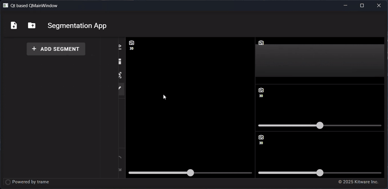

# Project Description

<!-- Add a short paragraph describing the project. -->

Following our success in bringing core 3D Slicer functionalities on the web with the trame framework, we are continuing
our endeavor by adding more connectivity between the Slicer application and the trame ecosystem.

This project will bring a connection between the Slicer application scene and the trame application providing a stepping
stone for exciting new features such as:

- Real time review and cooperation in one viewer
- Remote IGT display on tablets or light devices
- Interactive teaching modules
- ...

## Objective

<!-- Describe here WHAT you would like to achieve (what you will have as end result). -->

1. New module / logic dedicated to starting a trame server in the main thread
2. Library components for users to define their own mirroring
3. Example on linking the trame-slicer Segmentation application with the Slicer main application

## Approach and Plan

<!-- Describe here HOW you would like to achieve the objectives stated above. -->

1. Proof of concept of starting a trame server in the Slicer application thread
2. Test of putting trame components into the Qt layout using QWebEngine components
3. Implementation / test of scene interactive linking between Slicer and trame Slicer
4. Bi directional interaction on the same Scene and interactivity tests

## Progress and Next Steps

<!-- Update this section as you make progress, describing of what you have ACTUALLY DONE.
     If there are specific steps that you could not complete then you can describe them here, too. -->

### Progress

The trame-server relies on an aiohttp server and uses the main async Event Loop to establish a one to one connection to
a client. 

In the context of the SlicerTrame server, the application starts a dedicated Slicer-app-real process and in this context
the trame-server takes control of the main event loop. It is then effectively blocking the UI.

To start the SlicerTrame server without blocking the UI, the trame-server can be started in another Thread and use a 
new event loop in this thread (blocking the given thread).

We have been able to test this using `PyQt6` + `qasync` and producing the expected behavior of mixing trame with the 
`Qt` layer and have a responsive environment.

In our tests, the trame-server was launched by the Qt application and be connected callbacks using qtSignal / slots.

### Technical points to address

In the Slicer Python environment, the following points need to be addressed for proper integration:

1. Qt6 is required for modern web view access (Slicer 6+)
2. The default Web API needs to be set to OpenGL for compatibility with the default view layer
3. Direct threading is not available and the actual start / management of the trame-server needs to be sorted out
   * At the moment, threading can be *kind of* hacked using PyQt6 QThread objects.
   * qasync can be used with PyQt6 to provide a trame-server start / stop
   * In this context the event loop seems to be blocked / lag behind when the VTK OpenGL views are not hovered
4. Direct usage / inheritance of QThread in the Slicer context will make Slicer crash 
5. The trame-slicer application / views / etc. needs to be created in the main Qt Thread to avoid threading problems

### Next step(s)

* Investigate QThread creation with QtPython in the Slicer python environment
* Architecture design for the Slicer / trame-slicer State interaction
* Test(s) of view rendering / streaming between Slicer and trame-slicer

# Illustrations

<!-- Add pictures and links to videos that demonstrate what has been accomplished. -->

PyQt trame-slicer integration POC: 

Slicer trame UI integration POC:

_No response_

# Background and References

<!-- If you developed any software, include link to the source code repository.
     If possible, also add links to sample data, and to any relevant publications. -->

- trame-slicer library: [https://github.com/KitwareMedical/trame-slicer](https://github.com/KitwareMedical/trame-slicer)
- Slicer trame extension: [https://github.com/KitwareMedical/SlicerTrame](https://github.com/KitwareMedical/SlicerTrame)
- QAsync : [https://github.com/CabbageDevelopment/qasync](https://github.com/CabbageDevelopment/qasync)
- QThread usage in QtPython: [https://github.com/MeVisLab/pythonqt/issues/44#issuecomment-3352759196](https://github.com/MeVisLab/pythonqt/issues/44#issuecomment-3352759196)

