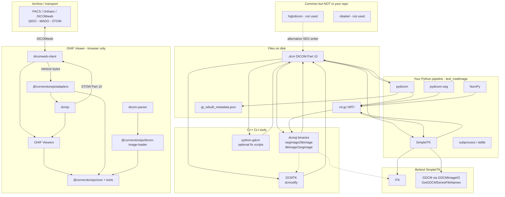

# Project Description

OHIF Viewer is a widely used web-based medical image viewer built on Cornerstone3D. Segmentation is central to many clinical and research workflows, yet reliability and robustness in OHIF/Cornerstone still lag behind user expectations — with recurring errors and edge cases in everyday use ([OHIF/Viewers#5453](https://github.com/OHIF/Viewers/issues/5453)).

During Project Week 45, I would like to focus on improving the stability and user experience of segmentation in OHIF/Cornerstone. I am looking forward to collaborating with others interested in segmentation, digital pathology, and web-based imaging viewers.

This project targets three complementary areas:

- **Workflow reliability** — Reduce errors and fragile behavior in common segmentation tasks (loading, editing, saving, and display).
- **Representation interoperability** — Enable better interchangeability between contour-based and labelmap-based segmentations inside OHIF/Cornerstone3D.
- **Microscopy segmentation** — Explore segmentation support for whole-slide and microscopy images in OHIF, as in the [SLIM](https://github.com/MGHComputationalPathology/slim) viewer.

Several related gaps remain in the broader stack: the WSI microscopy viewer (`wsi-microscopy-viewer`) does not yet support segmentation display, overlapping segmentations are not always handled reliably, and contour ↔ labelmap conversion is not yet exposed end-to-end in OHIF. This project aims to advance solutions within Cornerstone3D and OHIF toward a more dependable segmentation experience across radiology and pathology use cases.

For DICOM persistence, standards context, and recommended interchange with research formats (NIfTI), see [Background and References](#background-and-references).

## Objective

1. **Improve segmentation reliability** — Identify and address high-impact failure modes in OHIF/Cornerstone segmentation workflows (load, render, edit, persist) to reduce user-facing errors.
2. **Contour ↔ labelmap interoperability** — Allow users and tools to convert between contour-based and labelmap-based segmentation representations in OHIF/Cornerstone3D, building on work such as [Cornerstone3D PR #2170](https://github.com/cornerstonejs/cornerstone3D/pull/2170).
3. **Microscopy segmentation support** — Enable segmentation rendering (labelmap and/or contour overlay) in the OHIF WSI microscopy viewer, progressing toward capabilities comparable to SLIM.
4. **DICOM persistence** — Clarify recommended save/load paths for segmentations (DICOM SEG and emerging label-map encodings) and validate practical DICOM ↔ NIfTI interchange (see [DICOM-SEG and format interchange](#dicom-seg-and-format-interchange)).

## Approach and Plan

1. **Audit current state** — Review segmentation pain points in OHIF/Viewers and Cornerstone3D; compare microscopy segmentation support in `wsi-microscopy-viewer` vs. SLIM and document pipeline gaps.
2. **Reliability fixes** — Triage and reproduce issues from community reports (e.g. [#5453](https://github.com/OHIF/Viewers/issues/5453), [#5849](https://github.com/OHIF/Viewers/issues/5849)); prototype fixes or workarounds for the most impactful cases.
3. **Contour ↔ labelmap conversion** — Review and test upstream conversion work; expose it in the OHIF UI so users need not convert representations manually.
4. **Microscopy segmentation MVP** — Integrate Cornerstone3D segmentation rendering into the OHIF WSI microscopy viewport; target labelmap overlay as a first milestone.
5. **Overlapping segments** — Investigate segment blending/ordering in Cornerstone3D so multiple overlapping segments render and interact correctly.
6. **DICOM persistence audit** — Map save/load paths (classic SEG vs label-map objects); test against [OHIF/Viewers PR #5806](https://github.com/OHIF/Viewers/pull/5806); document DICOM ↔ NIfTI assumptions ([background notes](#dicom-seg-and-format-interchange)).
7. **Integration testing** — Validate changes with real DICOM SEG and RT-STRUCT datasets (radiology and pathology); record short demo screencasts.
8. **Documentation and follow-up** — Open or update GitHub issues/PRs in `cornerstonejs/cornerstone3D` and `OHIF/Viewers` for work continuing beyond the week.

## Progress and Next Steps

*(To be filled in during and after the event)*

1. …
2. …
3. …

# Illustrations

<!-- Add screenshots, diagrams, or screen recordings here once available. -->

# Background and References

## OHIF and Cornerstone3D

| Resource | Notes |
|----------|--------|
| [OHIF Viewer](https://ohif.org/) | Web viewer |
| [Cornerstone3D](https://github.com/cornerstonejs/cornerstone3D) | Rendering engine |
| [Cornerstone3D PR #2170](https://github.com/cornerstonejs/cornerstone3D/pull/2170) | Contour ↔ labelmap conversion |
| [SLIM Viewer](https://github.com/MGHComputationalPathology/slim) | Microscopy segmentation reference |
| [OHIF WSI Microscopy Viewer](https://github.com/ImagingDataCommons/wsi-microscopy-viewer) | WSI viewer (limited segmentation support) |

### Related OHIF issues and pull requests

| Item | Relevance |
|------|-----------|
| [#5453](https://github.com/OHIF/Viewers/issues/5453) | Segmentation reliability |
| [#5849](https://github.com/OHIF/Viewers/issues/5849) | Labelmap interpolation (editing; affects exported SEG) |
| [#4875](https://github.com/OHIF/Viewers/issues/4875) | DICOM label-map support |
| [PR #5806](https://github.com/OHIF/Viewers/pull/5806) | SEG load/save via per-frame imageLoader; shared dcmjs writer |
| [#2833](https://github.com/OHIF/Viewers/issues/2833) | Interoperability between highdicom-authored SEGs and OHIF |

## DICOM-SEG and format interchange

Reference material for persistence, standards, tooling, and conversion with NIfTI. Intended as background for the [DICOM persistence](#dicom-persistence) objective and [approach step 6](#approach-and-plan).

### Recommended practice

| Goal | Recommended approach | Typical stack |
|------|---------------------|---------------|
| Clinical / PACS / multi-site sharing | **DICOM Segmentation** (SOP Class `1.2.840.10008.5.1.4.1.1.66.4`) via **DICOMweb** alongside source images | OHIF `cornerstone-dicom-seg`, `@cornerstonejs/adapters`, **dcmjs**; offline creation with **highdicom** or **dcmqi** |
| In-viewer editing in OHIF | Cornerstone3D **labelmap** or **contour** during interaction; **export to DICOM SEG** on save from referenced volume metadata | `@cornerstonejs/adapters`, **dcmjs** ([PR #5806](https://github.com/OHIF/Viewers/pull/5806): shared `dicomWriter.ts`, preserved transfer syntax) |
| Research / ML pipelines | **NIfTI**, **NRRD**, or Slicer **`.seg.nrrd`** internally; DICOM at archive boundaries | SimpleITK, NiBabel, Slicer; **highdicom** or **pydicom-seg** for DICOM export |
| Many non-overlapping segments (100+) | **Label-map** encodings when available; classic **BINARY** SEG remains valid but often large/slow | **highdicom** LABELMAP prototypes; **DCMTK/dcmqi**; OHIF [#5806](https://github.com/OHIF/Viewers/pull/5806) (labelmap RLE where supported) |

**OHIF loading ([PR #5806](https://github.com/OHIF/Viewers/pull/5806)):** Replaces whole-object `ArrayBuffer` fetch with **per-frame `imageLoader` decoding** (Cornerstone3D `fix/use-imageLoader-for-seg`). Improves load/save for labelmap and compressed bitmap SEGs. Parser type (`labelmap` vs `bitmap`) follows SOP Class / pixel layout. **Caveat:** multi-frame SEGs on non–WADO-RS schemes (`dicomfile:`, `wadouri:`) may decode only one frame without error if `/frames/N` URLs are missing.

### Standards landscape

Three related tracks:

1. **Segmentation IOD (existing)** — [Part 3 §C.8.20](https://dicom.nema.org/medical/dicom/current/output/chtml/part03/sect_C.8.20.html). Types include `BINARY` and `FRACTIONAL`. Multiple segments historically meant **separate binary frame sets** (supports overlap; inefficient for many non-overlapping labels). See [PW38 DICOM SEG notes](https://projectweek.na-mic.org/PW38_2023_GranCanaria/Projects/DICOMSEG/).

2. **Supplement 243 — Label Map Segmentation (Final Text, DICOM 2024d)** — Dedicated IOD: pixel values encode segment membership in one array (no overlap per instance). [NEMA Sup 243](https://dicom.nema.org/Dicom/News/August2024/index.html#sup243) · [overview](https://developer.digitalhealth.gov.au/standards/sup-243-label-map-segmentation). Prototypes: **highdicom** ([PW39](https://projectweek.na-mic.org/PW39_2023_Montreal/Projects/DefiningAndPrototypingLabelmapSegmentationsInDicomFormat/)); **DCMTK/dcmqi/Slicer** ([PW40](https://projectweek.na-mic.org/PW40_2024_GranCanaria/Projects/DICOMLabelmaps/)).

3. **`LABELMAP` Segmentation Type (classic SEG object)** — Community encodings on the existing Segmentation IOD (RLE/JPEG-LS/JP2K). Example (TotalSegmentator, PW39): ~385 MB binary vs ~1.9–6.7 MB compressed labelmap.

**OHIF:** [#4875](https://github.com/OHIF/Viewers/issues/4875) tracks first-class label-map support. Until broadly available, assume **classic DICOM SEG** for production interchange; experiment with label-map objects alongside [#5806](https://github.com/OHIF/Viewers/pull/5806).

### DICOM SEG vs NIfTI — why both persist

| | DICOM SEG | NIfTI / NRRD / seg.nrrd |
|---|-----------|-------------------------|
| Strengths | Standard SOP Class; segment metadata; FoR / referenced series; DICOMweb / PACS | Fast I/O; ML ecosystem; simple dense arrays |
| Weaknesses | Size/speed for many-segment binary SEG; viewer variance | Weak clinical metadata; no study linkage without sidecars |

**Hub-and-spoke pattern:** NIfTI or in-memory labelmaps inside analysis; **DICOM SEG at the boundary** for VNA/PACS, OHIF, or Slicer.

### DICOM ↔ NIfTI interchange

#### DICOM SEG → NIfTI

Mostly lossless for voxels if geometry and labels are preserved:

- **Geometry** — `Image Orientation Patient`, spacing, and `Image Position Patient` from the **referenced series** (or per-frame functional groups). NIfTI `sform`/`qform` must match the DICOM patient frame.
- **Labels** — Map **Segment Number** → NIfTI integer; optional sidecar for **Segment Label** and coded categories.
- **Overlaps** — Binary SEG may overlap; one NIfTI labelmap cannot — use per-segment volumes, multi-channel data, or fail explicitly.
- **Tools** — `highdicom` / `pydicom-seg` (Python); **dcmqi** / Quantitative Reporting (Slicer); **dcmjs** / adapters (OHIF).

#### NIfTI → DICOM SEG

NIfTI does not carry DICOM identity or segment ontology. Required inputs:

| Input | If missing |
|-------|------------|
| Referenced series (Study/Series/SOP UIDs, Frame of Reference UID) | Must be chosen explicitly — cannot derive from NIfTI alone |
| Spatial alignment with reference grid | Resample NIfTI to reference geometry or document transform |
| Per-segment metadata (number, label, category codes) | Sidecar JSON/CSV or defaults |
| Segmentation Type | `BINARY`, `LABELMAP`, or Sup 243 object per overlap/tooling support |
| Overlap policy | Overlapping labels in one array need separate binary segments or another representation |

**Suggested pipeline:** load reference DICOM → resample labelmap → encode with **highdicom** or **dcmqi** → validate in OHIF via DICOMweb. Web-only: **dcmjs** adapters from Cornerstone labelmaps when viewport metadata includes the reference study.

### Package Overview



### DICOM tooling map

```
                    ┌─────────────────────────────────────────┐
                    │           Application layer            │
                    │  OHIF  │  3D Slicer  │  ML scripts     │
                    └────┬──────────┬──────────────┬──────────┘
                         │          │              │
           ┌─────────────┼──────────┼──────────────┼─────────────┐
           ▼             ▼          ▼              ▼             ▼
      dcmjs +      cornerstone-   dcmqi +     highdicom    pydicom-seg
      adapters     dicom-seg      Quant.       (+ pydicom)  (+ SimpleITK)
           │             Reporting      │
           └─────────────┬──────────────┘
                         ▼
              pydicom (Python)  │  dicomParser (JS, legacy)
                         ▼
              DCMTK / GDCM (C++) — dcmseg, DIMSE
```

| Package | Language | Role |
|---------|----------|------|
| [pydicom](https://github.com/pydicom/pydicom) | Python | Low-level DICOM I/O |
| [highdicom](https://github.com/ImagingDataCommons/highdicom) | Python | SEG/SR/PR builders; label-map prototypes |
| [pydicom-seg](https://github.com/razorx89/pydicom-seg) | Python | Fast multiclass SEG → SimpleITK |
| [dcmjs](https://github.com/dcmjs-org/dcmjs) | JavaScript | Browser SEG (de)serialization |
| [@cornerstonejs/adapters](https://github.com/cornerstonejs/cornerstone3D/tree/main/packages/adapters) | TypeScript | Labelmap/contour ↔ DICOM SEG |
| [DCMTK](https://www.dcmtk.org/) / dcmseg | C++ | Reference encoding |
| [dcmqi](https://github.com/QIICR/dcmqi) | C++ / CLI | ITK/NIfTI ↔ DICOM SEG (Slicer) |

Validate round-trips (**highdicom → OHIF → dcmjs → Slicer**) when changing write options (transfer syntax, `fragmentMultiframe`, labelmap vs bitmap).

## DICOM standards and Project Week notes

- [DICOM Segmentation (Part 3 §C.8.20)](https://dicom.nema.org/medical/dicom/current/output/chtml/part03/sect_C.8.20.html)
- [Supplement 243 — Label Map Segmentation (2024d)](https://dicom.nema.org/Dicom/News/August2024/index.html#sup243)
- [PW38 — DICOM Segmentation Optimization](https://projectweek.na-mic.org/PW38_2023_GranCanaria/Projects/DICOMSEG/)
- [PW39 — Labelmap segmentations in DICOM](https://projectweek.na-mic.org/PW39_2023_Montreal/Projects/DefiningAndPrototypingLabelmapSegmentationsInDicomFormat/)
- [PW40 — DICOM Label Map (DCMTK/dcmqi)](https://projectweek.na-mic.org/PW40_2024_GranCanaria/Projects/DICOMLabelmaps/)
- [OHIF Office Hours 2025-03-06](https://github.com/OHIF/OHIF-Office-Hours/blob/821390caa419b408085578a2b8fc6a8767829015/notes/2025-03-06.md) — label-map discussion ([#4875](https://github.com/OHIF/Viewers/issues/4875))
- [dicom4qi](https://dicom4qi.readthedocs.io/) — interoperability testing
