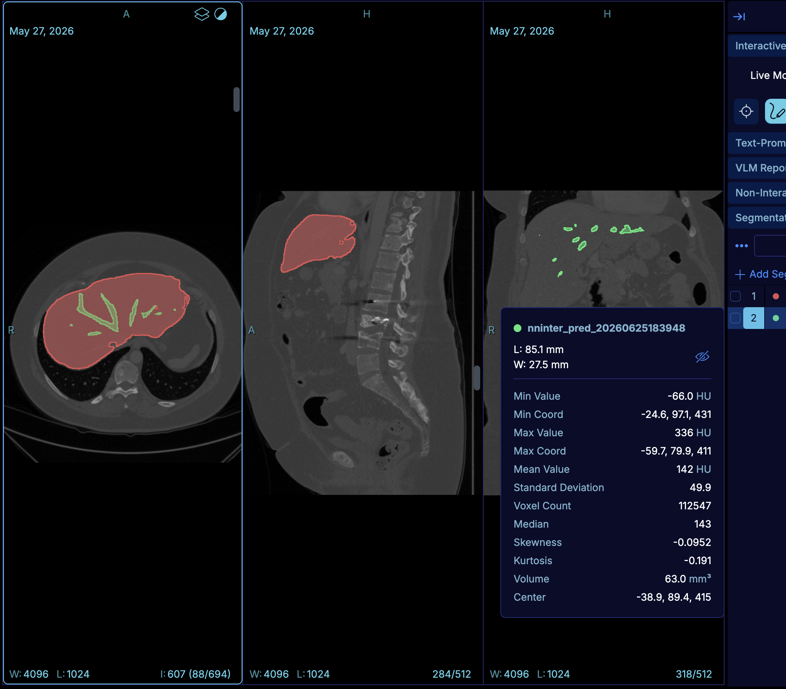

# Project Description

OHIF Viewer is a widely used web-based medical image viewer built on Cornerstone3D. Segmentation is central to many clinical and research workflows, yet reliability and robustness in OHIF/Cornerstone still lag behind user expectations — with recurring errors and edge cases in everyday use ([OHIF/Viewers#5453](https://github.com/OHIF/Viewers/issues/5453)).

During Project Week 45, I would like to focus on improving the stability and user experience of segmentation in OHIF/Cornerstone. I am looking forward to collaborating with others interested in segmentation, digital pathology, and web-based imaging viewers.

This project targets two complementary areas:

- **DICOM-SEG landscape** — Understand the development and history of DICOM Segmentation, current standard direction (including label-map encodings), and recommended usage for save/load and interchange with research formats.
- **Overlapping segments in OHIF** — Ensure overlapping segmentations work reliably across **Stack Viewport + MPR**, **Volume Viewport**, and downstream tools — **segmentation statistics** and **bidirectional measurements**.

Several related gaps remain in the broader stack: overlapping segmentations are not always handled reliably across viewport types, DICOM persistence paths are still evolving ([PR #5806](https://github.com/OHIF/Viewers/pull/5806), [#4875](https://github.com/OHIF/Viewers/issues/4875)), and contour ↔ labelmap conversion is not yet exposed end-to-end in OHIF. This project aims to advance solutions within Cornerstone3D and OHIF toward a more dependable segmentation experience.

For DICOM persistence, standards context, and recommended interchange with research formats (NIfTI), see [Background and References](#background-and-references).

## Objective

1. **Understand DICOM-SEG** — Review the development and history of DICOM Segmentation (classic binary/fractional SEG, emerging label-map encodings, tooling ecosystem) and document **recommended usage** for saving, loading, and sharing segmentations in clinical and research workflows (see [DICOM-SEG and format interchange](#dicom-seg-and-format-interchange)).

2. **Overlapping segments across OHIF viewports and measurements** — In the context of OHIF, ensure **overlapping segments** work correctly for **Stack Viewport + MPR** and **Volume Viewport**, and that this behavior is connected to working **segmentation statistics** and **bidirectional measurements** on those segmentations (see [Illustrations](#illustrations)).

## Approach and Plan

1. **DICOM-SEG review** — Summarize standard history (binary SEG → label-map Sup 243), tooling roles (dcmjs, highdicom, dcmqi, etc.), and recommended save/load paths; validate against [PR #5806](https://github.com/OHIF/Viewers/pull/5806) ([background notes](#dicom-seg-and-format-interchange)).
2. **Reproduce overlapping-segment issues** — Triage reports (e.g. [#5453](https://github.com/OHIF/Viewers/issues/5453), [Cornerstone3D PR #2170](https://github.com/cornerstonejs/cornerstone3D/pull/2170)) across Stack + MPR and Volume viewports.
3. **Fix overlapping segment rendering** — Investigate segment blending/ordering in Cornerstone3D so multiple overlapping segments render and interact correctly in all target viewport types.
4. **Connect stats and bidirectional measurements** — Verify segmentation statistics (volume, HU stats, voxel count) and bidirectional tool output remain correct when segments overlap and when switching between Stack/MPR and Volume layouts.

## Progress and Next Steps

*(To be filled in during and after the event)*

1. …
2. …
3. …

# Illustrations

OHIF MPR layout (Stack + MPR viewports) with overlapping segmentations (red and green), segmentation statistics, and bidirectional measurements:



# Background and References

## OHIF and Cornerstone3D

| Resource | Notes |
|----------|--------|
| [OHIF Viewer](https://ohif.org/) | Web viewer |
| [Cornerstone3D](https://github.com/cornerstonejs/cornerstone3D) | Rendering engine |
| [Cornerstone3D PR #2170](https://github.com/cornerstonejs/cornerstone3D/pull/2170) | Contour ↔ labelmap conversion |
| [SLIM Viewer](https://github.com/MGHComputationalPathology/slim) | Microscopy segmentation reference |
| [OHIF WSI Microscopy Viewer](https://github.com/ImagingDataCommons/wsi-microscopy-viewer) | WSI viewer (limited segmentation support) |

### Related OHIF issues and pull requests

| Item | Relevance |
|------|-----------|
| [#5453](https://github.com/OHIF/Viewers/issues/5453) | Segmentation reliability |
| [#5849](https://github.com/OHIF/Viewers/issues/5849) | Labelmap interpolation (editing; affects exported SEG) |
| [#4875](https://github.com/OHIF/Viewers/issues/4875) | DICOM label-map support |
| [PR #5806](https://github.com/OHIF/Viewers/pull/5806) | SEG load/save via per-frame imageLoader; shared dcmjs writer |
| [#2833](https://github.com/OHIF/Viewers/issues/2833) | Interoperability between highdicom-authored SEGs and OHIF |

## DICOM-SEG and format interchange

Reference material for persistence, standards, tooling, and conversion with NIfTI. Intended as background for [objective 1](#objective) and [approach step 1](#approach-and-plan).

### Recommended practice

| Goal | Recommended approach | Typical stack |
|------|---------------------|---------------|
| Clinical / PACS / multi-site sharing | **DICOM Segmentation** (SOP Class `1.2.840.10008.5.1.4.1.1.66.4`) via **DICOMweb** alongside source images | OHIF `cornerstone-dicom-seg`, `@cornerstonejs/adapters`, **dcmjs**; offline creation with **highdicom** or **dcmqi** |
| In-viewer editing in OHIF | Cornerstone3D **labelmap** or **contour** during interaction; **export to DICOM SEG** on save from referenced volume metadata | `@cornerstonejs/adapters`, **dcmjs** ([PR #5806](https://github.com/OHIF/Viewers/pull/5806): shared `dicomWriter.ts`, preserved transfer syntax) |
| Research / ML pipelines | **NIfTI**, **NRRD**, or Slicer **`.seg.nrrd`** internally; DICOM at archive boundaries | SimpleITK, NiBabel, Slicer; **highdicom** or **pydicom-seg** for DICOM export |
| Many non-overlapping segments (100+) | **Label-map** encodings when available; classic **BINARY** SEG remains valid but often large/slow | **highdicom** LABELMAP prototypes; **DCMTK/dcmqi**; OHIF [#5806](https://github.com/OHIF/Viewers/pull/5806) (labelmap RLE where supported) |

**OHIF loading ([PR #5806](https://github.com/OHIF/Viewers/pull/5806)):** Replaces whole-object `ArrayBuffer` fetch with **per-frame `imageLoader` decoding** (Cornerstone3D `fix/use-imageLoader-for-seg`). Improves load/save for labelmap and compressed bitmap SEGs. Parser type (`labelmap` vs `bitmap`) follows SOP Class / pixel layout. **Caveat:** multi-frame SEGs on non–WADO-RS schemes (`dicomfile:`, `wadouri:`) may decode only one frame without error if `/frames/N` URLs are missing.

### Standards landscape

Three related tracks:

1. **Segmentation IOD (existing)** — [Part 3 §C.8.20](https://dicom.nema.org/medical/dicom/current/output/chtml/part03/sect_C.8.20.html). Types include `BINARY` and `FRACTIONAL`. Multiple segments historically meant **separate binary frame sets** (supports overlap; inefficient for many non-overlapping labels). See [PW38 DICOM SEG notes](https://projectweek.na-mic.org/PW38_2023_GranCanaria/Projects/DICOMSEG/).

2. **Supplement 243 — Label Map Segmentation (Final Text, DICOM 2024d)** — Dedicated IOD: pixel values encode segment membership in one array (no overlap per instance). [NEMA Sup 243](https://dicom.nema.org/Dicom/News/August2024/index.html#sup243) · [overview](https://developer.digitalhealth.gov.au/standards/sup-243-label-map-segmentation). Prototypes: **highdicom** ([PW39](https://projectweek.na-mic.org/PW39_2023_Montreal/Projects/DefiningAndPrototypingLabelmapSegmentationsInDicomFormat/)); **DCMTK/dcmqi/Slicer** ([PW40](https://projectweek.na-mic.org/PW40_2024_GranCanaria/Projects/DICOMLabelmaps/)).

3. **`LABELMAP` Segmentation Type (classic SEG object)** — Community encodings on the existing Segmentation IOD (RLE/JPEG-LS/JP2K). Example (TotalSegmentator, PW39): ~385 MB binary vs ~1.9–6.7 MB compressed labelmap.

**OHIF:** [#4875](https://github.com/OHIF/Viewers/issues/4875) tracks first-class label-map support. Until broadly available, assume **classic DICOM SEG** for production interchange; experiment with label-map objects alongside [#5806](https://github.com/OHIF/Viewers/pull/5806).

### DICOM SEG vs NIfTI — why both persist

| | DICOM SEG | NIfTI / NRRD / seg.nrrd |
|---|-----------|-------------------------|
| Strengths | Standard SOP Class; segment metadata; FoR / referenced series; DICOMweb / PACS | Fast I/O; ML ecosystem; simple dense arrays |
| Weaknesses | Size/speed for many-segment binary SEG; viewer variance | Weak clinical metadata; no study linkage without sidecars |

**Hub-and-spoke pattern:** NIfTI or in-memory labelmaps inside analysis; **DICOM SEG at the boundary** for VNA/PACS, OHIF, or Slicer.

### DICOM ↔ NIfTI interchange

#### DICOM SEG → NIfTI

Mostly lossless for voxels if geometry and labels are preserved:

- **Geometry** — `Image Orientation Patient`, spacing, and `Image Position Patient` from the **referenced series** (or per-frame functional groups). NIfTI `sform`/`qform` must match the DICOM patient frame.
- **Labels** — Map **Segment Number** → NIfTI integer; optional sidecar for **Segment Label** and coded categories.
- **Overlaps** — Binary SEG may overlap; one NIfTI labelmap cannot — use per-segment volumes, multi-channel data, or fail explicitly.
- **Tools** — `highdicom` / `pydicom-seg` (Python); **dcmqi** / Quantitative Reporting (Slicer); **dcmjs** / adapters (OHIF).

#### NIfTI → DICOM SEG

NIfTI does not carry DICOM identity or segment ontology. Required inputs:

| Input | If missing |
|-------|------------|
| Referenced series (Study/Series/SOP UIDs, Frame of Reference UID) | Must be chosen explicitly — cannot derive from NIfTI alone |
| Spatial alignment with reference grid | Resample NIfTI to reference geometry or document transform |
| Per-segment metadata (number, label, category codes) | Sidecar JSON/CSV or defaults |
| Segmentation Type | `BINARY`, `LABELMAP`, or Sup 243 object per overlap/tooling support |
| Overlap policy | Overlapping labels in one array need separate binary segments or another representation |

**Suggested pipeline:** load reference DICOM → resample labelmap → encode with **highdicom** or **dcmqi** → validate in OHIF via DICOMweb. Web-only: **dcmjs** adapters from Cornerstone labelmaps when viewport metadata includes the reference study.

### Package Overview

Project Week pages do not render Mermaid; the diagrams below use plain text so they display on [projectweek.na-mic.org](https://projectweek.na-mic.org).

**End-to-end data flow**

```
  Files on disk                    Archive / transport
  ┌──────────────┐                 ┌─────────────────────────────┐
  │ .dcm (SEG)   │◄───────────────►│ PACS / Orthanc / DICOMweb   │
  │ .nii.gz      │    STOW/QIDO    │ QIDO · WADO-RS · STOW-RS    │
  └──────┬───────┘                 └──────────────┬──────────────┘
         │                                        │
         │ read/write                             │ retrieve / store
         ▼                                        ▼
  ┌──────────────────────────────────────────────────────────────────┐
  │                     Conversion & I/O layers                       │
  ├─────────────────────┬──────────────────────┬─────────────────────┤
  │ Python (offline)    │ C++ CLI              │ Browser (OHIF)      │
  │ · pydicom           │ · dcmqi              │ · dicomweb-client   │
  │ · pydicom-seg       │   segimage2itkimage  │ · dcmjs             │
  │ · SimpleITK/NumPy   │   itkimage2segimage  │ · @cornerstonejs/   │
  │ · highdicom         │ · DCMTK (dcmodify)   │   adapters          │
  │                     │ · python-gdcm        │ · cornerstone-dicom-│
  │                     │                      │   seg               │
  └─────────┬───────────┴──────────┬───────────┴──────────┬──────────┘
            │                      │                      │
            └──────────┬───────────┴──────────────────────┘
                       ▼
            ┌─────────────────────┐
            │ ITK / GDCM (C++)    │  ← behind SimpleITK & dcmqi
            └─────────────────────┘
                       │
                       ▼
            ┌─────────────────────┐
            │ OHIF + Cornerstone3D│  labelmap / contour in viewport
            │ core + tools        │  → stats, bidirectional, export
            └─────────────────────┘
```

**Layer stack (who sits on whom)**

```
                    ┌─────────────────────────────────────────┐
                    │           Application layer             │
                    │  OHIF  │  3D Slicer  │  ML / Python     │
                    └────┬──────────┬──────────────┬───────────┘
                         │          │              │
           ┌─────────────┼──────────┼──────────────┼─────────────┐
           ▼             ▼          ▼              ▼             ▼
      dcmjs +      cornerstone-   dcmqi +     highdicom    pydicom-seg
      adapters     dicom-seg      Quant.       (+ pydicom)  (+ SimpleITK)
           │             Reporting      │
           └─────────────┬──────────────┘
                         ▼
              pydicom (Python)  │  dicom-parser (JS, legacy)
                         ▼
              DCMTK / GDCM (C++) — dcmseg, DIMSE
```

| Package | Language | Role |
|---------|----------|------|
| [pydicom](https://github.com/pydicom/pydicom) | Python | Low-level DICOM I/O |
| [highdicom](https://github.com/ImagingDataCommons/highdicom) | Python | SEG/SR/PR builders; label-map prototypes |
| [pydicom-seg](https://github.com/razorx89/pydicom-seg) | Python | Fast multiclass SEG → SimpleITK |
| [dcmjs](https://github.com/dcmjs-org/dcmjs) | JavaScript | Browser SEG (de)serialization |
| [@cornerstonejs/adapters](https://github.com/cornerstonejs/cornerstone3D/tree/main/packages/adapters) | TypeScript | Labelmap/contour ↔ DICOM SEG |
| [DCMTK](https://www.dcmtk.org/) / dcmseg | C++ | Reference encoding |
| [dcmqi](https://github.com/QIICR/dcmqi) | C++ / CLI | ITK/NIfTI ↔ DICOM SEG (Slicer) |

Validate round-trips (**highdicom → OHIF → dcmjs → Slicer**) when changing write options (transfer syntax, `fragmentMultiframe`, labelmap vs bitmap).

## DICOM standards and Project Week notes

- [DICOM Segmentation (Part 3 §C.8.20)](https://dicom.nema.org/medical/dicom/current/output/chtml/part03/sect_C.8.20.html)
- [Supplement 243 — Label Map Segmentation (2024d)](https://dicom.nema.org/Dicom/News/August2024/index.html#sup243)
- [PW38 — DICOM Segmentation Optimization](https://projectweek.na-mic.org/PW38_2023_GranCanaria/Projects/DICOMSEG/)
- [PW39 — Labelmap segmentations in DICOM](https://projectweek.na-mic.org/PW39_2023_Montreal/Projects/DefiningAndPrototypingLabelmapSegmentationsInDicomFormat/)
- [PW40 — DICOM Label Map (DCMTK/dcmqi)](https://projectweek.na-mic.org/PW40_2024_GranCanaria/Projects/DICOMLabelmaps/)
- [OHIF Office Hours 2025-03-06](https://github.com/OHIF/OHIF-Office-Hours/blob/821390caa419b408085578a2b8fc6a8767829015/notes/2025-03-06.md) — label-map discussion ([#4875](https://github.com/OHIF/Viewers/issues/4875))
- [dicom4qi](https://dicom4qi.readthedocs.io/) — interoperability testing
