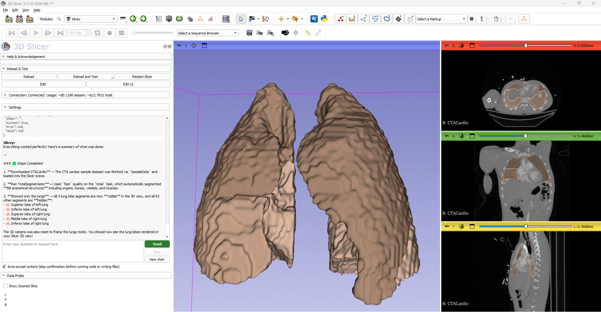

# Project Description

<!-- Add a short paragraph describing the project. -->

Slicey is a new scripted module (in the [SlicerSandbox](https://github.com/PerkLab/SlicerSandbox) extension) that embeds an AI coding agent directly inside 3D Slicer. Instead of copy-pasting code snippets into the Python console or running a separate MCP server, the user chats with Claude in a panel docked in Slicer, and Claude can read/write files in folders the user explicitly shares, and write and execute Python code in a real, running Slicer session (either the user's current window or an isolated companion instance) to carry out the request.

## Objective

<!-- Describe here WHAT you would like to achieve (what you will have as end result). -->

1. Embed a general-purpose AI coding agent into 3D Slicer that users who are not familiar (or do not want to install) Visual Studio Code can use. Users can describe a task in plain language and have it written and executed live in Slicer, without a separate IDE, MCP server, or manual copy-pasting into the Python console.
2. Give the agent narrowly scoped, explicit access to local files (only folders the user shares, read-only or read-write) and to a real Slicer Python environment, rather than broad, uncontrolled access to the user's machine.
3. Make day-to-day use trustworthy: visible cost estimates, persisted chat logs, and a settings panel for choosing the model, the execution target, and custom system-prompt instructions.

## Approach and Plan

<!-- Describe here HOW you would like to achieve the objectives stated above. -->

1. Build a scripted Slicer module (Slicey) with a Qt chat UI backed by the Anthropic Claude Messages API (the `anthropic` Python package is installed on demand via `pip_install`).
2. Implement a small tool-calling protocol the agent can use: `list_shared_folders`, `list_directory`, `read_text_file`, `write_text_file`, and `run_python_in_slicer`.
3. Let `run_python_in_slicer` target either the user's already-open Slicer window (affects the live scene/GUI immediately) or a separate, isolated companion Slicer process with no scene loaded, switchable from Settings.
4. Dogfood the agent while building it, fixing real failure modes as they come up (truncated tool calls, history corruption when stopping mid tool-call, the execution-target setting being ignored), and iterate on the chat UI/UX.

## Progress and Next Steps

<!-- Update this section as you make progress, describing of what you have ACTUALLY DONE.
     If there are specific steps that you could not complete then you can describe them here, too. -->

Built over the course of the project week, mostly generated by Claude Sonnet. The [Slicey module](https://github.com/PerkLab/SlicerSandbox/tree/master/Slicey) module is available in the Sandbox extension for Slicer-5.12 and later. Details:

1. **Add Slicey AI chatbot** - initial module: chat panel embedded in Slicer, Claude API integration, and the first tool set giving the agent shared-folder file access plus the ability to run Python code in Slicer.
2. **Improve Slicey user interface** - added a live billing/cost-estimate display and an improved UI layout.
3. **Improved Slicey GUI** - simplified the layout further and added a section for appending custom instructions to the system prompt.
4. **Fix Slicey tool-call bugs, add chat logging and console output access**:
   - Raised `max_tokens` and added actionable error messages so large tool calls (e.g. writing a whole file) don't get silently truncated.
   - Fixed conversation corruption when Stop is clicked mid tool-call, and made the chat self-heal histories that were already stuck in that state.
   - Made the Execution setting (current Slicer window vs. separate companion instance) actually control where `run_python_in_slicer` runs, instead of Claude picking "current" regardless of the user's choice.
   - Added per-chat Markdown logging (to a configurable folder, updated live as messages come in) and renamed "Clear chat" to "New chat".
   - Added `getPythonConsoleOutput()` so Claude can inspect recent activity in Slicer's own Python console, including output from the user's manual GUI interactions.

Next steps: gather feedback from other Project Week participants on the chat UX and tool set, consider additional tools (e.g. scene-introspection helpers, screenshot capture), and continue hardening the agent loop.

# Illustrations

<!-- Add pictures and links to videos that demonstrate what has been accomplished.

-->

<!-- TODO: add screenshots of the Slicey chat panel and Settings -->

# Background and References

<!-- If you developed any software, include link to the source code repository.
     If possible, also add links to sample data, and to any relevant publications. -->

- Source code: [Slicey module in SlicerSandbox](https://github.com/PerkLab/SlicerSandbox/tree/master/Slicey)
- Built on the [Claude API](https://docs.claude.com/) (Anthropic)
- Available in the Sandbox extension from Slicer-5.12 and above
