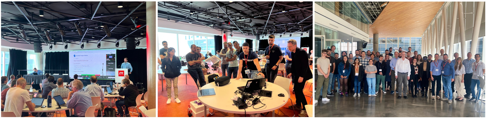
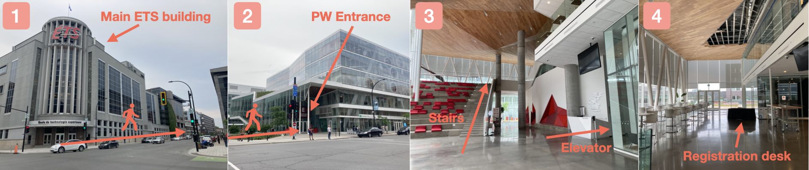

# Welcome to the web page for the 47th Project Week!

This event will take place June 28th - July 2nd, 2027 in Montreal, Canada.

## Location

École de Technologie Supérieure (ETS), Montreal, Canada - **E Building**

The images below show how to get to the Project Week conference room. If you Google "ETS", it will take you to the main building of the university (1). You need to walk about 200 meters to get to the building called "Maison des étudiants" (2). Enter the building and either climb the stairs or take the elevator on the right to reach the second floor (3). From there, you should easily find the registration desk.

Venue entrance on Google Maps: [https://goo.gl/maps/xNedgMBt4C6jwiCu5](https://goo.gl/maps/xNedgMBt4C6jwiCu5)

## How to participate

* We hold weekly online preparation meetings before the workshop.
* These meetings are an opportunity to introduce yourself, find a project you want to participate in during the workshop or propose one yourself and find collaborators. You will also find out more about how the workshop works.
* **Register as soon as possible** to help us plan the number of attendees.

## Breakout sessions

## Projects

## Registration

Registration details coming soon.

## Remote participation

For members of the community that are unable to attend Project Week in person this time, it will be possible to watch the main sessions that will be broadcast on Zoom:
1. Project introduction (Monday 10am ET)
2. What's new in Slicer breakout session (Tuesday 10am ET)
3. Project results presentation (Friday 10am ET)

## Discord

The **Discord** application is used to communicate between team members and organize activities before and during Project Week. Please join the Project Week [Discord server](https://discord.gg/AkxzKvqMBp) as soon as possible and explore its functionality before the workshop. For more information on the use of Discord before and during Project Week, please visit [this page](../common/Discord.md).

## Agenda



## Registrants

Do not add your name to this list below. It is maintained by the organizers based on your registration.

List of registered participants so far (names will be added here after processing registrations):

<!-- Participants list is updated programmatically, please don't remove the comments -->
<!-- Participants list start -->
<!-- Participants list end -->

## Organizers

* [@tkapur](https://github.com/tkapur) ([Tina Kapur, PhD](http://www.spl.harvard.edu/pages/People/tkapur)),
* [@drouin-simon](https://github.com/drouin-simon) ([Simon Drouin, PhD](https://drouin-simon.github.io/ETS-web//))
* [@rafaelpalomar](https://github.com/rafaelpalomar) ([Rafael Palomar, PhD](https://www.ntnu.edu/employees/rafaelp))
* [@deepakri201](https://github.com/deepakri201) ([Deepa Krishnaswamy, PhD](https://scholar.google.com/citations?user=X8jB1n0AAAAJ&hl=en))
* Theodore Aptekarev
* [@sjh26](https://github.com/sjh26) ([Sam Horvath, PhD](https://www.kitware.com/samantha-horvath/))

## History

Please read about our experience in running these events since 2005: [Increasing the Impact of Medical Image Computing Using
Community-Based Open-Access Hackathons: the NA-MIC and 3D Slicer Experience](http://perk.cs.queensu.ca/sites/perkd7.perkd7.ca/files/Kapur2016.pdf).
