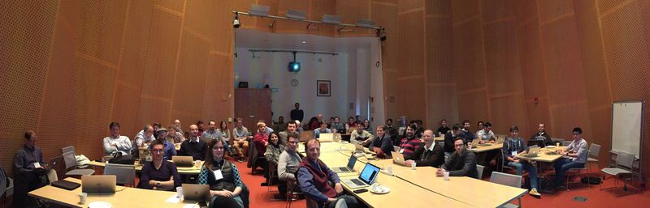

## Welcome to the main page for the Project Week events!

### The 45th Project Week will take place on June 22-26, 2026, in person at MIT, Boston, USA.

## Frequently Asked Questions

#### What?

The Project Week is a week-long hackathon of hands on activity in which medical image computing researchers create solutions using the open source image computing platform, [3D Slicer](http://www.slicer.org), and [VTK](http://www.vtk.org), [ITK](http://www.itk.org), [CMake](http://www.cmake.org), and [CDash](http://www.cdash.org) libraries as well as [OHIF](http://ohif.org), [Cornerstone](https://cornerstonejs.org/), [dcmjs](https://github.com/dcmjs-org), [vtkjs](https://kitware.github.io/vtk-js/), [itkjs](https://insightsoftwareconsortium.github.io/itk-js/), [DICOMweb](https://www.dicomstandard.org/dicomweb/), [Girder](https://girder.readthedocs.io/) and related web technologies. Participants work collaboratively on solutions that lie on the interfaces of the fields of computer science, mechanical engineering, biomedical engineering, and medicine. In contrast to conferences and workshops where the primary focus is to report results, the objective of the Project Week is to provide a venue for creators of medical image computing open-source software creators to collaboratively work.

#### When, where, how much?

The Project Week events are held twice a year, January in Europe, and June in North America, with ad-hoc meetings added occasionally. The registration fee for in-person events is approximately 500 (USD or Euro), and is used to cover breakfast, lunch, and coffee.

#### How does it work?

Weekly videoconferences for preparation begin 8 weeks before an event. Potential participants propose projects during these meetings, and collaboratively create a list of projects that are of mutual interest. The projects include platform work, algorithm development, and biomedical applications. Through the course of the meetings, each participant selects one or more project teams and develops goals for the week. The first day of the Project Week itself begins with a 2-hour  introduction to all projects and participants. The rest of the week consists of a mix of working sessions and breakout sessions on special topics, as decided by the participants during the preparatory meetings. The event concludes on the last (5th day) with a 2-hour progress report for all projects.

#### Who can attend?

Project Weeks are open to all and publicly advertised. Email announcements are sent to the [Project Week mailing list](https://public.kitware.com/mailman/listinfo/na-mic-project-week) (for continuity) and posted on the [Project Week forum](https://discourse.slicer.org/c/community/project-week). One-day participation is permitted for first-time attendees, but rest stay for the entire event.

#### Who should attend?

Please attend a preparatory videoconference to determine if your project has resonance with the other participants who are planning to attend that particular event (see each Project Week page for details).

#### What else?

The Project Week series was founded in 2005, along with the National Alliance for Medical Image Computing (NAMIC), which was chartered by the NIH to build a computational infrastructure for biomedical research. Today, Project Week has become one of the major events in the calendars of several NIH-funded Center efforts where they convene and collaborate. Participants in Project Week include [NAC](http://nac.spl.harvard.edu/), [NCIGT](http://www.ncigt.org/), [QIICR](http://qiicr.org/), and [CANARIE](https://www.canarie.ca/). Additional details about our experience in running these events since 2005 are available here: [Increasing the Impact of Medical Image Computing Using Community-Based Open-Access Hackathons: the NA-MIC and 3D Slicer Experience](http://www.sciencedirect.com/science/article/pii/S1361841516301128).

#### Who to contact?

Project Weeks are led by [@tkapur](https://github.com/tkapur) ([Tina Kapur, PhD](http://www.spl.harvard.edu/pages/People/tkapur)), [@drouin-simon](https://github.com/drouin-simon) ([Simon Drouin, PhD](https://drouin-simon.github.io/ETS-web//)), [@rafaelpalomar](https://github.com/rafaelpalomar) ([Rafael Palomar, PhD](https://www.ntnu.edu/employees/rafaelp)), [@piiq](https://github.com/piiq) ([Theodore Aptekarev](https://discourse.slicer.org/u/pll_llq)) and [@sjh26](https://github.com/sjh26) (Sam Horvath) who are happy to tell you more about them.

## Upcoming Project Weeks

  Project Week 45 will take place on June 22-26, 2026, in person at MIT, Boston, USA. 
  Project Week 46 will take place on January 25-29, 2027, in person in Las Palmas de Gran Canaria, Spain.

## Past Project Weeks

| Events | Registrants |
|----|----|
| [2026 January 26-30 Project Week 44](PW44_2026_GranCanaria/README.md) - Gran Canaria, Spain. | 48 |
| [2025 June 23-27: Project Week 43](PW43_2025_Montreal/README.md) - Montreal, Canada. | 56 |
| [2025 January 27-31: Project Week 42](PW42_2025_GranCanaria/README.md) - Gran Canaria, Spain. | 63 |
| [2024 June 24-28: Project Week 41](PW41_2024_MIT/README.md) - MIT, Cambridge, MA, USA. | 116 |
| [2024 January 29-February 2: Project Week 40](PW40_2024_GranCanaria/README.md) - Gran Canaria, Spain   It recorded 204 registered attendees (from 29 countries, 51% first-timers). |204 |
| [2023 June 12-16: Project Week 39](PW39_2023_Montreal/README.md) - Online and Montreal, Canada   It recorded 154 registered attendees (from 23 countries, 46% first-timers). | 154 |
| [2023 January 30-February 3rd: Project Week 38](PW38_2023_GranCanaria/README.md) - Online and Gran Canaria, Spain  It recorded 251 registered attendees (from 30 countries, 52% first-timers). | 251 |
| [2022 June 27-July 1: Project Week 37](PW37_2022_Virtual/README.md) - Online   It recorded 117 registered attendees (from 20 countries, 41% first-timers.) | 117 |
| [2022 Jan 17-21: Project Week 36](PW36_2022_Virtual/README.md) - Online and Gran Canaria, Spain.   It recorded 131 registered attendees (from 26 countries, 44% first-timers.) | 131 |
| [2021 June 28-July 2: Project Week 35](PW35_2021_Virtual/README.md) - Internet.   It recorded 140 registered attendees (from 23 countries, 44% first-timers.)|140|
| [2020 December 14-18: Project Week 34](PW34_2020_Virtual/README.md) - Internet.   It recorded 204 registered attendees (from 26 countries and 101 institutions.)|204|
| [2020 January 20-24: Project Week 33](PW33_2020_GranCanaria/README.md) - Gran Canaria, Spain.  It recorded 66 registered attendees (from 16 countries) who worked on 43 projects. | 66 |
| [2019 July 15-29: Project Week 32](PW32_2019_London_Canada/README.md) - Robarts Research, London, Canada. | 38 |
| [2019 June 24-28 :Project Week 31](PW31_2019_Boston/README.md) - MIT, Cambridge, MA, USA.  It recorded 78 registered attendees, who worked on 47 projects and attended 5 breakout sessions. | 78 |
| [2019 January 28-February 1: Project Week 30](PW30_2019_GranCanaria/README.md) - Gran Canaria, Spain.  It recorded 60 registered attendees (from 13 countries) who worked on 33 projects. | 60 |
| [2018 July 16-20: Project Week 29](PW29_2018_London_Canada/README.md) - Robarts Research Institute, London, Ontario, Canada.  It recorded 37 registered attendees. This was a satellite event with a slight focus on new users and community expansion. | 37 |
| [2018 June 25-29: Project Week 28](PW28_2018_GranCanaria/README.md) - Gran Canaria, Spain.  It recorded 58 registered attendees, who worked on 31 projects.| 58 |
| [2018 January 8-12: Project Week 27](PW27_2018_Boston/README.md) - MIT, Cambridge, MA, USA.  It recorded 72 registered attendees, who worked on 52 projects and attended 5 breakout sessions. | 72 |
| [2017 July 17-21: Project Week 26](PW26_2017_London_Canada/README.md) - Robarts Research Institute, London, ON, Canada. | 58 |
| [2017 June 26-30: Project Week 25](https://www.na-mic.org/wiki/2017_Summer_Project_Week) - Catanzaro Lido, Calabria, Italy.  It recorded 51 registered attendees, who worked on 29 projects. | 51 |
| [2017 January 9-13: Project Week 24](https://www.na-mic.org/wiki/2017_Winter_Project_Week) - MIT, Cambridge, MA, USA.  It recorded 99 registered attendees, who worked on 55 projects. | 99 |
| [2016 June 20-25: Project Week 23](https://na-mic.org/wiki/2016_Summer_Project_Week) - DKFZ, Heidelberg, Germany. | 58 |
| [2016 January 4-8: Project Week 22](https://na-mic.org/wiki/2016_Winter_Project_Week) - MIT, Cambridge, MA, USA. | 77 |
| [2015 June 21-24: Project Week 21](https://na-mic.org/wiki/2015_Summer_Project_Week) - Barcelona, Spain. | 55 |
| [2015 January 5-9: Winter Project Week](https://na-mic.org/wiki/2015_Winter_Project_Week) - Salt Lake City, UT, USA. | 44 |
| [2014 June 23-27: Summer Project Week](https://na-mic.org/wiki/2014_Summer_Project_Week) - MIT, Cambridge, MA, USA. | 81 |
| [2014 January 6-10: Winter Project Week](https://na-mic.org/wiki/2014_Winter_Project_Week) - Salt Lake City, UT, USA. | 70 |
| [2013 June 17-21: Summer Project Week](https://na-mic.org/wiki/2013_Summer_Project_Week) - MIT, Cambridge, MA, USA. | 104 |
| [2013 January 7-11: Winter Project Week](https://na-mic.org/wiki/2013_Winter_Project_Week) - Salt Lake City, UT, USA. | 80 |
| [2012 June 18-22: Summer Project Week](https://na-mic.org/wiki/2012_Summer_Project_Week) - MIT, Cambridge, MA, USA. | 88 |
| [2012 January 9-13: Winter Project Week](https://na-mic.org/wiki/2012_Winter_Project_Week) - Salt Lake City, UT, USA. | 103 |
| [2011 June 20-24: Summer Project Week](https://na-mic.org/wiki/2011_Summer_Project_Week) - MIT, Cambridge, MA, USA. | 101 |
| [2011 January 10-14: Winter Project Week](https://na-mic.org/wiki/2011_Winter_Project_Week) - Salt Lake City, UT, USA. | 106 |
| [2010 June 21-25: Summer Project Week](https://na-mic.org/wiki/2010_Summer_Project_Week) - MIT, Cambridge, MA, USA. | 126 |
| [2010 January 4-8: Winter Project Week](https://na-mic.org/wiki/2010_Winter_Project_Week) - Salt Lake City, UT, USA. | 107 |
| [2009 June 22-26: Summer Project Week](https://na-mic.org/wiki/2009_Summer_Project_Week) - MIT, Cambridge, MA, USA. | 134 |
| [2009 January 5-9: Winter Project Week](https://na-mic.org/wiki/2009_Winter_Project_Week) - Salt Lake City, UT, USA. | 98 |
| [2008 June 23-27: Summer Project Week](https://na-mic.org/wiki/2008_Summer_Project_Week) - MIT, Cambridge, MA, USA. | 113 |
| [2008 January 7-11: Winter Project Week](https://na-mic.org/wiki/2008_Winter_Project_Week) - Salt Lake City, UT, USA. | 87 |
| [2007 June 25-29: Summer Project Week](https://na-mic.org/wiki/2007_Programming/Project_Week_MIT) - MIT, Cambridge, MA, USA. | 85 |
| [2007 January 10-12: Winter Project Week](https://na-mic.org/wiki/AHM_2007) - Salt Lake City, UT, USA. | 96 |
| [2006 June 26-30: Summer Project Week](https://na-mic.org/wiki/2006_Programming/Project_Week_MIT) - MIT, Cambridge, MA, USA. | 56 |
| [2006 January 8-13: Winter Project Week](https://na-mic.org/wiki/AHM_2006:AHM_2006) - Salt Lake City, UT, USA. | 80 |
| [2005 June 27-July 1: Summer Project Week](https://na-mic.org/wiki/Engineering:Programmers_Week_Summer_2005) - MIT, Cambridge, MA, USA. | 44 |
| [2005 February 20-22: The First All-Hands-Meeting and Programming Event](https://na-mic.org/wiki/AHM_2005:Main) - Salt Lake City, UT, USA. | 58 |

---
This page is hosted [from the NA-MIC organization's ProjectWeek repository on github.com](https://github.com/NA-MIC/ProjectWeek) and is published at [https://projectweek.na-mic.org](https://projectweek.na-mic.org)
